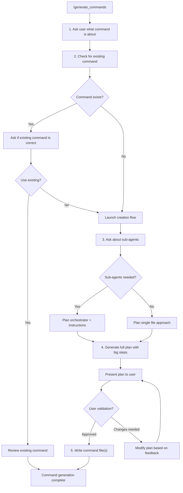

<!---
Notes for developer ONLY:
- Use Claude to validate your mermaid schema in an artefact
-->

# Instructions `generate_commands`

Aims to generate or modify commands.

- Can be an existing command
- Orchestration commands are the onces with orchestration logic
- Instructions are the agent one, focus on single behavior, goal and outcome
- Write files in English
- Claude command files are stored in `aidd/commands/`

## Command generation flow

- `agent` are snake_case commands
- Actions are regular mermaid (e.g. `["Review existing command"]`)

## Command files (Orchestrators)

Orchestrate a flow, bind to others commands, launch parallel tasks...

Template:
@aidd/templates/orchestration.md

## Instruction files

Define behavior, provide guidance, and ensure clarity in command execution.

Template:
@aidd/templates/instruction.md
