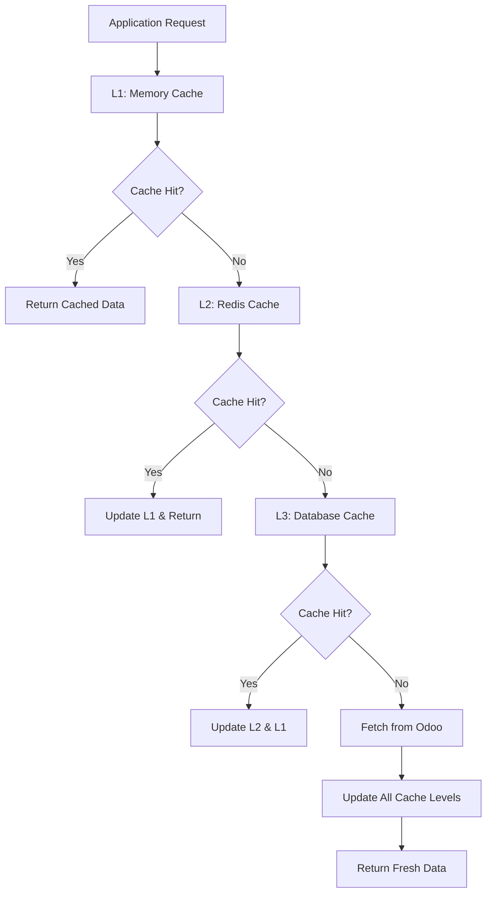

# Caching & Performance Optimization for Odoo Integration

## Overview

This document defines comprehensive caching strategies and performance optimizations for the Odoo integration system. The design emphasizes multi-level caching, intelligent cache invalidation, and performance monitoring to ensure scalable, responsive operations.

## Multi-Level Caching Architecture

### 1. Cache Hierarchy Design



### 2. Cache Level Specifications

```typescript
interface CacheLevel {
  name: string
  storage: CacheStorage
  ttl: number
  maxSize: number
  evictionPolicy: EvictionPolicy
  consistency: ConsistencyLevel
}

enum ConsistencyLevel {
  STRONG = 'STRONG',      // Always fetch latest
  EVENTUAL = 'EVENTUAL',  // Accept stale data
  WEAK = 'WEAK'          // Best effort
}

enum EvictionPolicy {
  LRU = 'LRU',           // Least Recently Used
  LFU = 'LFU',           // Least Frequently Used
  TTL = 'TTL',           // Time To Live
  FIFO = 'FIFO'          // First In, First Out
}

class CacheLevelConfig {
  static readonly L1_MEMORY: CacheLevel = {
    name: 'Memory',
    storage: CacheStorage.MEMORY,
    ttl: 60000,           // 1 minute
    maxSize: 1000,        // 1000 entries
    evictionPolicy: EvictionPolicy.LRU,
    consistency: ConsistencyLevel.WEAK
  }
  
  static readonly L2_REDIS: CacheLevel = {
    name: 'Redis',
    storage: CacheStorage.REDIS,
    ttl: 300000,          // 5 minutes
    maxSize: 100000,      // 100k entries
    evictionPolicy: EvictionPolicy.TTL,
    consistency: ConsistencyLevel.EVENTUAL
  }
  
  static readonly L3_DATABASE: CacheLevel = {
    name: 'Database',
    storage: CacheStorage.DATABASE,
    ttl: 3600000,         // 1 hour
    maxSize: -1,          // Unlimited
    evictionPolicy: EvictionPolicy.TTL,
    consistency: ConsistencyLevel.EVENTUAL
  }
}
```

### 3. Hierarchical Cache Implementation

```typescript
class HierarchicalCacheService implements ICacheService {
  private l1Cache: MemoryCache
  private l2Cache: RedisCache
  private l3Cache: DatabaseCache
  private metrics: CacheMetrics
  
  constructor(
    redisClient: Redis,
    databaseClient: DatabaseClient,
    metricsService: IMetricsService
  ) {
    this.l1Cache = new MemoryCache(CacheLevelConfig.L1_MEMORY)
    this.l2Cache = new RedisCache(redisClient, CacheLevelConfig.L2_REDIS)
    this.l3Cache = new DatabaseCache(databaseClient, CacheLevelConfig.L3_DATABASE)
    this.metrics = new CacheMetrics(metricsService)
  }
  
  async get<T>(key: string, deserializer?: (data: any) => T): Promise<T | null> {
    const startTime = Date.now()
    let cacheLevel = 'MISS'
    
    try {
      // Try L1 first
      let value = await this.l1Cache.get<T>(key)
      if (value !== null) {
        cacheLevel = 'L1'
        this.metrics.recordHit('L1', Date.now() - startTime)
        return deserializer ? deserializer(value) : value
      }
      
      // Try L2 second
      value = await this.l2Cache.get<T>(key)
      if (value !== null) {
        cacheLevel = 'L2'
        // Populate L1 for future requests
        await this.l1Cache.set(key, value, CacheLevelConfig.L1_MEMORY.ttl)
        this.metrics.recordHit('L2', Date.now() - startTime)
        return deserializer ? deserializer(value) : value
      }
      
      // Try L3 last
      value = await this.l3Cache.get<T>(key)
      if (value !== null) {
        cacheLevel = 'L3'
        // Populate L2 and L1 for future requests
        await Promise.all([
          this.l2Cache.set(key, value, CacheLevelConfig.L2_REDIS.ttl),
          this.l1Cache.set(key, value, CacheLevelConfig.L1_MEMORY.ttl)
        ])
        this.metrics.recordHit('L3', Date.now() - startTime)
        return deserializer ? deserializer(value) : value
      }
      
      // Cache miss
      this.metrics.recordMiss(Date.now() - startTime)
      return null
      
    } catch (error) {
      this.metrics.recordError(cacheLevel, error)
      throw error
    }
  }
  
  async set(key: string, value: any, ttl?: number): Promise<void> {
    const startTime = Date.now()
    
    try {
      // Write to all cache levels in parallel
      await Promise.all([
        this.l1Cache.set(key, value, ttl || CacheLevelConfig.L1_MEMORY.ttl),
        this.l2Cache.set(key, value, ttl || CacheLevelConfig.L2_REDIS.ttl),
        this.l3Cache.set(key, value, ttl || CacheLevelConfig.L3_DATABASE.ttl)
      ])
      
      this.metrics.recordWrite(Date.now() - startTime)
      
    } catch (error) {
      this.metrics.recordError('WRITE', error)
      throw error
    }
  }
  
  async invalidate(key: string): Promise<void> {
    // Invalidate from all levels
    await Promise.all([
      this.l1Cache.delete(key),
      this.l2Cache.delete(key),
      this.l3Cache.delete(key)
    ])
  }
  
  async invalidatePattern(pattern: string): Promise<void> {
    // Pattern-based invalidation
    await Promise.all([
      this.l1Cache.deletePattern(pattern),
      this.l2Cache.deletePattern(pattern),
      this.l3Cache.deletePattern(pattern)
    ])
  }
  
  async warmup(keys: string[]): Promise<void> {
    // Pre-populate cache with frequently accessed data
    const batchSize = 100
    for (let i = 0; i < keys.length; i += batchSize) {
      const batch = keys.slice(i, i + batchSize)
      await this.warmupBatch(batch)
    }
  }
  
  private async warmupBatch(keys: string[]): Promise<void> {
    // Fetch from origin and populate all cache levels
    const fetchPromises = keys.map(async (key) => {
      try {
        const data = await this.fetchFromOrigin(key)
        if (data) {
          await this.set(key, data)
        }
      } catch (error) {
        // Log but don't fail the entire batch
        this.logger.warn('Warmup failed for key', { key, error: error.message })
      }
    })
    
    await Promise.allSettled(fetchPromises)
  }
  
  async getStats(): Promise<CacheStats> {
    const [l1Stats, l2Stats, l3Stats] = await Promise.all([
      this.l1Cache.getStats(),
      this.l2Cache.getStats(),
      this.l3Cache.getStats()
    ])
    
    return {
      l1: l1Stats,
      l2: l2Stats,
      l3: l3Stats,
      overall: this.metrics.getOverallStats()
    }
  }
}
```

## Cache Key Strategies

### 1. Hierarchical Key Naming

```typescript
class CacheKeyBuilder {
  private static readonly SEPARATOR = ':'
  private static readonly VERSION = 'v1'
  
  // Supplier-related keys
  static supplierList(filters?: SupplierFilter): string {
    const filterHash = filters ? this.hashFilters(filters) : 'all'
    return this.buildKey('supplier', 'list', filterHash)
  }
  
  static supplierDetails(supplierId: string): string {
    return this.buildKey('supplier', 'detail', supplierId)
  }
  
  static supplierProducts(supplierId: string, page?: number): string {
    const pageKey = page ? `page-${page}` : 'all'
    return this.buildKey('supplier', 'products', supplierId, pageKey)
  }
  
  // Order-related keys
  static orderSync(localOrderId: string): string {
    return this.buildKey('sync', 'order', localOrderId)
  }
  
  static orderMapping(localOrderId: string): string {
    return this.buildKey('mapping', 'order', localOrderId)
  }
  
  static orderStatus(odooOrderId: number): string {
    return this.buildKey('order', 'status', odooOrderId.toString())
  }
  
  // Product-related keys
  static productCatalog(supplierId: string, category?: string): string {
    const categoryKey = category || 'all'
    return this.buildKey('product', 'catalog', supplierId, categoryKey)
  }
  
  static productDetails(productId: string): string {
    return this.buildKey('product', 'detail', productId)
  }
  
  static searchResults(query: string, filters?: ProductFilter): string {
    const filterHash = filters ? this.hashFilters(filters) : 'none'
    const queryHash = this.hashString(query)
    return this.buildKey('search', 'results', queryHash, filterHash)
  }
  
  // Session and user-related keys
  static userSession(userId: string): string {
    return this.buildKey('session', 'user', userId)
  }
  
  static userPermissions(userId: string): string {
    return this.buildKey('permissions', 'user', userId)
  }
  
  // System configuration keys
  static systemConfig(configType: string): string {
    return this.buildKey('config', 'system', configType)
  }
  
  static integrationHealth(): string {
    return this.buildKey('health', 'integration')
  }
  
  // Helper methods
  private static buildKey(...parts: string[]): string {
    return [this.VERSION, ...parts].join(this.SEPARATOR)
  }
  
  private static hashFilters(filters: any): string {
    const sortedKeys = Object.keys(filters).sort()
    const normalizedFilters = sortedKeys.reduce((acc, key) => {
      acc[key] = filters[key]
      return acc
    }, {} as any)
    
    return this.hashString(JSON.stringify(normalizedFilters))
  }
  
  private static hashString(str: string): string {
    // Simple hash function for cache keys
    let hash = 0
    for (let i = 0; i < str.length; i++) {
      const char = str.charCodeAt(i)
      hash = ((hash << 5) - hash) + char
      hash = hash & hash // Convert to 32-bit integer
    }
    return Math.abs(hash).toString(16)
  }
  
  // Pattern helpers for batch operations
  static supplierPattern(): string {
    return this.buildKey('supplier', '*')
  }
  
  static orderPattern(): string {
    return this.buildKey('*', 'order', '*')
  }
  
  static userPattern(userId: string): string {
    return this.buildKey('*', 'user', userId)
  }
}
```

### 2. Cache Invalidation Strategies

```typescript
class CacheInvalidationService {
  constructor(
    private cacheService: ICacheService,
    private eventBus: IEventService
  ) {
    this.setupEventHandlers()
  }
  
  private setupEventHandlers(): void {
    // Order-related invalidations
    this.eventBus.subscribe('ORDER_CREATED', async (event: OrderCreatedEvent) => {
      await this.invalidateOrderRelatedCache(event.entityId)
    })
    
    this.eventBus.subscribe('ORDER_UPDATED', async (event: OrderUpdatedEvent) => {
      await this.invalidateOrderRelatedCache(event.entityId)
    })
    
    this.eventBus.subscribe('ORDER_SYNCED', async (event: OrderSyncedEvent) => {
      await this.invalidateOrderSyncCache(event.entityId)
    })
    
    // Supplier-related invalidations
    this.eventBus.subscribe('SUPPLIER_UPDATED', async (event: SupplierUpdatedEvent) => {
      await this.invalidateSupplierCache(event.supplierId)
    })
    
    // Product-related invalidations
    this.eventBus.subscribe('PRODUCT_UPDATED', async (event: ProductUpdatedEvent) => {
      await this.invalidateProductCache(event.productId)
    })
  }
  
  async invalidateOrderRelatedCache(orderId: string): Promise<void> {
    const invalidationTasks = [
      // Order-specific caches
      this.cacheService.invalidate(CacheKeyBuilder.orderSync(orderId)),
      this.cacheService.invalidate(CacheKeyBuilder.orderMapping(orderId)),
      
      // User-related caches (since user's order list changed)
      this.cacheService.invalidatePattern(CacheKeyBuilder.userPattern('*')),
      
      // Search result caches (might include this order)
      this.cacheService.invalidatePattern(CacheKeyBuilder.buildKey('search', '*'))
    ]
    
    await Promise.allSettled(invalidationTasks)
  }
  
  async invalidateSupplierCache(supplierId: string): Promise<void> {
    const invalidationTasks = [
      // Supplier-specific caches
      this.cacheService.invalidate(CacheKeyBuilder.supplierDetails(supplierId)),
      this.cacheService.invalidatePattern(CacheKeyBuilder.supplierProducts(supplierId, '*')),
      
      // Supplier list caches (might include this supplier)
      this.cacheService.invalidatePattern(CacheKeyBuilder.supplierPattern()),
      
      // Product catalog caches for this supplier
      this.cacheService.invalidatePattern(CacheKeyBuilder.productCatalog(supplierId, '*'))
    ]
    
    await Promise.allSettled(invalidationTasks)
  }
  
  async invalidateProductCache(productId: string): Promise<void> {
    const invalidationTasks = [
      // Product-specific cache
      this.cacheService.invalidate(CacheKeyBuilder.productDetails(productId)),
      
      // Search result caches (might include this product)
      this.cacheService.invalidatePattern(CacheKeyBuilder.buildKey('search', '*')),
      
      // Product catalog caches (product might be in multiple catalogs)
      this.cacheService.invalidatePattern(CacheKeyBuilder.buildKey('product', 'catalog', '*'))
    ]
    
    await Promise.allSettled(invalidationTasks)
  }
  
  // Time-based invalidation
  async scheduleInvalidation(keys: string[], delay: number): Promise<void> {
    setTimeout(async () => {
      const invalidationTasks = keys.map(key => this.cacheService.invalidate(key))
      await Promise.allSettled(invalidationTasks)
    }, delay)
  }
  
  // Batch invalidation for maintenance
  async invalidateAll(pattern?: string): Promise<void> {
    if (pattern) {
      await this.cacheService.invalidatePattern(pattern)
    } else {
      // Clear all cache levels
      await Promise.all([
        this.cacheService.invalidatePattern('*'),
        this.clearMetrics()
      ])
    }
  }
  
  private async clearMetrics(): Promise<void> {
    // Reset cache metrics
    await this.cacheService.resetStats()
  }
}
```

## Performance Optimization Strategies

### 1. Query Optimization and Batching

```typescript
class OptimizedOdooClient {
  private queryBatcher: QueryBatcher
  private connectionPool: ConnectionPool
  private requestCache: RequestCache
  
  constructor(config: OdooClientConfig) {
    this.queryBatcher = new QueryBatcher({
      batchSize: 100,
      batchDelay: 50, // 50ms
      maxWaitTime: 1000 // 1 second
    })
    
    this.connectionPool = new ConnectionPool({
      maxConnections: 10,
      idleTimeout: 300000 // 5 minutes
    })
    
    this.requestCache = new RequestCache({
      ttl: 60000, // 1 minute for request deduplication
      maxSize: 1000
    })
  }
  
  async searchRead(
    model: string,
    domain: any[],
    fields: string[],
    options: SearchReadOptions = {}
  ): Promise<any[]> {
    // Request deduplication
    const requestKey = this.getRequestKey('search_read', model, domain, fields, options)
    const cachedResult = await this.requestCache.get(requestKey)
    if (cachedResult) {
      return cachedResult
    }
    
    // Batch similar requests
    const batchedRequest: BatchedRequest = {
      method: 'search_read',
      model,
      domain,
      fields,
      options,
      resolve: null!, // Will be set by batcher
      reject: null!   // Will be set by batcher
    }
    
    const result = await this.queryBatcher.addRequest(batchedRequest)
    
    // Cache the result
    await this.requestCache.set(requestKey, result)
    
    return result
  }
  
  async batchRead(
    model: string,
    ids: number[],
    fields: string[]
  ): Promise<any[]> {
    // Split large batches to avoid memory issues
    const batchSize = 100
    const results: any[] = []
    
    for (let i = 0; i < ids.length; i += batchSize) {
      const batchIds = ids.slice(i, i + batchSize)
      const batchResult = await this.performBatchRead(model, batchIds, fields)
      results.push(...batchResult)
    }
    
    return results
  }
  
  private async performBatchRead(
    model: string,
    ids: number[],
    fields: string[]
  ): Promise<any[]> {
    const connection = await this.connectionPool.getConnection()
    
    try {
      return await connection.execute_kw(model, 'read', [ids], { fields })
    } finally {
      this.connectionPool.releaseConnection(connection)
    }
  }
  
  private getRequestKey(
    method: string,
    model: string,
    domain: any[],
    fields: string[],
    options: any
  ): string {
    return `${method}:${model}:${JSON.stringify(domain)}:${fields.join(',')}:${JSON.stringify(options)}`
  }
}

class QueryBatcher {
  private batches: Map<string, BatchedRequest[]> = new Map()
  private timers: Map<string, NodeJS.Timeout> = new Map()
  
  constructor(private config: BatchConfig) {}
  
  async addRequest(request: BatchedRequest): Promise<any> {
    return new Promise((resolve, reject) => {
      request.resolve = resolve
      request.reject = reject
      
      const batchKey = this.getBatchKey(request)
      
      if (!this.batches.has(batchKey)) {
        this.batches.set(batchKey, [])
      }
      
      const batch = this.batches.get(batchKey)!
      batch.push(request)
      
      // Execute batch if it's full
      if (batch.length >= this.config.batchSize) {
        this.executeBatch(batchKey)
      } else {
        // Set timer for partial batch
        this.setOrUpdateTimer(batchKey)
      }
    })
  }
  
  private getBatchKey(request: BatchedRequest): string {
    return `${request.method}:${request.model}:${JSON.stringify(request.fields)}`
  }
  
  private setOrUpdateTimer(batchKey: string): void {
    // Clear existing timer
    const existingTimer = this.timers.get(batchKey)
    if (existingTimer) {
      clearTimeout(existingTimer)
    }
    
    // Set new timer
    const timer = setTimeout(() => {
      this.executeBatch(batchKey)
    }, this.config.batchDelay)
    
    this.timers.set(batchKey, timer)
  }
  
  private async executeBatch(batchKey: string): Promise<void> {
    const batch = this.batches.get(batchKey)
    if (!batch || batch.length === 0) return
    
    // Clear batch and timer
    this.batches.delete(batchKey)
    const timer = this.timers.get(batchKey)
    if (timer) {
      clearTimeout(timer)
      this.timers.delete(batchKey)
    }
    
    try {
      // Combine all requests in the batch
      const combinedDomain = this.combineDomains(batch.map(r => r.domain))
      const firstRequest = batch[0]
      
      // Execute combined request
      const results = await this.executeCombinedRequest(
        firstRequest.model,
        firstRequest.method,
        combinedDomain,
        firstRequest.fields,
        firstRequest.options
      )
      
      // Distribute results back to individual requests
      this.distributeResults(batch, results)
      
    } catch (error) {
      // Reject all requests in the batch
      batch.forEach(request => request.reject(error))
    }
  }
  
  private combineDomains(domains: any[][]): any[] {
    // Combine multiple domains with OR logic
    if (domains.length === 1) return domains[0]
    
    return ['|', ...domains.flat()]
  }
  
  private distributeResults(batch: BatchedRequest[], results: any[]): void {
    // Simple distribution - each request gets all results
    // In a real implementation, you'd filter results based on each request's domain
    batch.forEach(request => request.resolve(results))
  }
}
```

### 2. Memory Management and Optimization

```typescript
class MemoryOptimizedCache {
  private cache: Map<string, CacheEntry> = new Map()
  private accessCount: Map<string, number> = new Map()
  private lastAccess: Map<string, number> = new Map()
  private memoryUsage = 0
  private maxMemoryUsage: number
  
  constructor(config: MemoryCacheConfig) {
    this.maxMemoryUsage = config.maxMemoryMB * 1024 * 1024 // Convert MB to bytes
    
    // Periodic cleanup
    setInterval(() => this.performMaintenance(), 60000) // Every minute
    
    // Monitor memory pressure
    this.setupMemoryMonitoring()
  }
  
  async set(key: string, value: any, ttl: number): Promise<void> {
    const serializedValue = this.serialize(value)
    const sizeInBytes = this.calculateSize(serializedValue)
    
    // Check memory limits
    if (this.memoryUsage + sizeInBytes > this.maxMemoryUsage) {
      await this.evictEntries(sizeInBytes)
    }
    
    // Remove existing entry if present
    if (this.cache.has(key)) {
      const existingEntry = this.cache.get(key)!
      this.memoryUsage -= existingEntry.size
    }
    
    // Add new entry
    const entry: CacheEntry = {
      value: serializedValue,
      size: sizeInBytes,
      createdAt: Date.now(),
      expiresAt: Date.now() + ttl,
      accessCount: 1,
      lastAccessed: Date.now()
    }
    
    this.cache.set(key, entry)
    this.accessCount.set(key, 1)
    this.lastAccess.set(key, Date.now())
    this.memoryUsage += sizeInBytes
  }
  
  async get<T>(key: string): Promise<T | null> {
    const entry = this.cache.get(key)
    if (!entry) return null
    
    // Check expiration
    if (Date.now() > entry.expiresAt) {
      this.delete(key)
      return null
    }
    
    // Update access statistics
    entry.accessCount++
    entry.lastAccessed = Date.now()
    this.accessCount.set(key, entry.accessCount)
    this.lastAccess.set(key, entry.lastAccessed)
    
    return this.deserialize<T>(entry.value)
  }
  
  private async evictEntries(requiredBytes: number): Promise<void> {
    const evictionCandidates = Array.from(this.cache.entries())
      .map(([key, entry]) => ({
        key,
        entry,
        score: this.calculateEvictionScore(key, entry)
      }))
      .sort((a, b) => a.score - b.score) // Lower score = higher priority for eviction
    
    let freedBytes = 0
    for (const candidate of evictionCandidates) {
      if (freedBytes >= requiredBytes) break
      
      this.delete(candidate.key)
      freedBytes += candidate.entry.size
    }
  }
  
  private calculateEvictionScore(key: string, entry: CacheEntry): number {
    const now = Date.now()
    const age = now - entry.createdAt
    const timeSinceLastAccess = now - entry.lastAccessed
    const accessFrequency = entry.accessCount / (age / 1000) // accesses per second
    
    // Lower score = higher priority for eviction
    // Factors: low access frequency, long time since last access, large size
    return (accessFrequency * 1000) - (timeSinceLastAccess / 1000) - (entry.size / 1024)
  }
  
  private serialize(value: any): Buffer {
    // Use efficient serialization
    if (Buffer.isBuffer(value)) return value
    if (typeof value === 'string') return Buffer.from(value, 'utf8')
    
    // Use MessagePack for better compression than JSON
    return Buffer.from(JSON.stringify(value), 'utf8')
  }
  
  private deserialize<T>(buffer: Buffer): T {
    const str = buffer.toString('utf8')
    try {
      return JSON.parse(str) as T
    } catch {
      return str as T
    }
  }
  
  private calculateSize(buffer: Buffer): number {
    return buffer.byteLength + 100 // Add overhead for metadata
  }
  
  private performMaintenance(): void {
    const now = Date.now()
    const keysToDelete: string[] = []
    
    // Find expired entries
    for (const [key, entry] of this.cache) {
      if (now > entry.expiresAt) {
        keysToDelete.push(key)
      }
    }
    
    // Delete expired entries
    keysToDelete.forEach(key => this.delete(key))
    
    // Log memory usage
    this.logger.debug('Cache maintenance completed', {
      totalEntries: this.cache.size,
      memoryUsageMB: this.memoryUsage / (1024 * 1024),
      deletedEntries: keysToDelete.length
    })
  }
  
  private setupMemoryMonitoring(): void {
    // Monitor Node.js memory usage
    setInterval(() => {
      const memUsage = process.memoryUsage()
      const heapUsedMB = memUsage.heapUsed / (1024 * 1024)
      const heapTotalMB = memUsage.heapTotal / (1024 * 1024)
      
      if (heapUsedMB > 512) { // More than 512MB
        this.logger.warn('High memory usage detected', {
          heapUsedMB,
          heapTotalMB,
          cacheMemoryMB: this.memoryUsage / (1024 * 1024)
        })
        
        // Aggressive cleanup if memory is high
        this.performAggressiveCleanup()
      }
    }, 30000) // Every 30 seconds
  }
  
  private async performAggressiveCleanup(): Promise<void> {
    // Remove bottom 25% of entries by access frequency
    const totalEntries = this.cache.size
    const entriesToRemove = Math.floor(totalEntries * 0.25)
    
    if (entriesToRemove > 0) {
      await this.evictEntries(entriesToRemove * 1024) // Assume average 1KB per entry
    }
  }
  
  delete(key: string): void {
    const entry = this.cache.get(key)
    if (entry) {
      this.memoryUsage -= entry.size
      this.cache.delete(key)
      this.accessCount.delete(key)
      this.lastAccess.delete(key)
    }
  }
  
  getStats(): MemoryCacheStats {
    return {
      entryCount: this.cache.size,
      memoryUsageBytes: this.memoryUsage,
      memoryUsageMB: this.memoryUsage / (1024 * 1024),
      memoryUtilization: this.memoryUsage / this.maxMemoryUsage,
      averageEntrySize: this.cache.size > 0 ? this.memoryUsage / this.cache.size : 0
    }
  }
}

interface CacheEntry {
  value: Buffer
  size: number
  createdAt: number
  expiresAt: number
  accessCount: number
  lastAccessed: number
}
```

### 3. Connection Pooling and Resource Management

```typescript
class OptimizedConnectionPool {
  private connections: PooledConnection[] = []
  private waitQueue: Array<{
    resolve: (connection: PooledConnection) => void
    reject: (error: Error) => void
    timestamp: number
  }> = []
  
  private metrics: ConnectionPoolMetrics
  private healthChecker: HealthChecker
  
  constructor(private config: ConnectionPoolConfig) {
    this.metrics = new ConnectionPoolMetrics()
    this.healthChecker = new HealthChecker(this.validateConnection.bind(this))
    
    // Initialize minimum connections
    this.initializePool()
    
    // Start background maintenance
    this.startMaintenance()
  }
  
  async getConnection(): Promise<PooledConnection> {
    const startTime = Date.now()
    
    // Try to get an available connection
    const availableConnection = this.connections.find(conn => 
      !conn.inUse && conn.isHealthy
    )
    
    if (availableConnection) {
      availableConnection.inUse = true
      availableConnection.lastUsed = new Date()
      availableConnection.usageCount++
      
      this.metrics.recordConnectionAcquired(Date.now() - startTime)
      return availableConnection
    }
    
    // Create new connection if under limit
    if (this.connections.length < this.config.maxConnections) {
      try {
        const newConnection = await this.createConnection()
        this.connections.push(newConnection)
        
        this.metrics.recordConnectionCreated(Date.now() - startTime)
        return newConnection
      } catch (error) {
        this.metrics.recordConnectionError(error)
        throw error
      }
    }
    
    // Wait for available connection
    return new Promise((resolve, reject) => {
      const timeoutHandle = setTimeout(() => {
        // Remove from queue
        const index = this.waitQueue.findIndex(item => 
          item.resolve === resolve && item.reject === reject
        )
        if (index > -1) {
          this.waitQueue.splice(index, 1)
        }
        
        this.metrics.recordConnectionTimeout()
        reject(new ConnectionTimeoutError('Connection pool timeout'))
      }, this.config.acquireTimeout)
      
      this.waitQueue.push({
        resolve: (connection) => {
          clearTimeout(timeoutHandle)
          this.metrics.recordConnectionAcquired(Date.now() - startTime)
          resolve(connection)
        },
        reject: (error) => {
          clearTimeout(timeoutHandle)
          this.metrics.recordConnectionError(error)
          reject(error)
        },
        timestamp: Date.now()
      })
    })
  }
  
  releaseConnection(connection: PooledConnection): void {
    connection.inUse = false
    connection.lastUsed = new Date()
    
    // Serve waiting requests
    const waiter = this.waitQueue.shift()
    if (waiter) {
      connection.inUse = true
      waiter.resolve(connection)
    }
    
    this.metrics.recordConnectionReleased()
  }
  
  private async initializePool(): Promise<void> {
    const initPromises = Array(this.config.minConnections)
      .fill(null)
      .map(() => this.createConnection())
    
    try {
      const connections = await Promise.all(initPromises)
      this.connections.push(...connections)
    } catch (error) {
      this.logger.error('Failed to initialize connection pool', { error: error.message })
    }
  }
  
  private async createConnection(): Promise<PooledConnection> {
    const connection = new OdooConnection(this.config.odooConfig)
    await connection.authenticate()
    
    return {
      connection,
      id: crypto.randomUUID(),
      createdAt: new Date(),
      lastUsed: new Date(),
      inUse: true, // Initially in use by the requester
      isHealthy: true,
      usageCount: 1,
      errorCount: 0
    }
  }
  
  private startMaintenance(): void {
    // Health check interval
    setInterval(async () => {
      await this.performHealthChecks()
    }, this.config.healthCheckInterval)
    
    // Cleanup interval
    setInterval(async () => {
      await this.cleanupIdleConnections()
    }, this.config.cleanupInterval)
    
    // Metrics reporting
    setInterval(() => {
      this.reportMetrics()
    }, 60000) // Every minute
  }
  
  private async performHealthChecks(): Promise<void> {
    const healthCheckPromises = this.connections
      .filter(conn => !conn.inUse)
      .map(async (conn) => {
        try {
          const isHealthy = await this.healthChecker.check(conn.connection)
          conn.isHealthy = isHealthy
          
          if (!isHealthy) {
            conn.errorCount++
            this.logger.warn('Unhealthy connection detected', { connectionId: conn.id })
          }
        } catch (error) {
          conn.isHealthy = false
          conn.errorCount++
          this.logger.error('Health check failed', { 
            connectionId: conn.id, 
            error: error.message 
          })
        }
      })
    
    await Promise.allSettled(healthCheckPromises)
  }
  
  private async cleanupIdleConnections(): Promise<void> {
    const now = new Date()
    const connectionsToClose = this.connections.filter(conn => 
      !conn.inUse && 
      (now.getTime() - conn.lastUsed.getTime()) > this.config.idleTimeout &&
      this.connections.length > this.config.minConnections
    )
    
    for (const conn of connectionsToClose) {
      try {
        await conn.connection.close()
        this.connections = this.connections.filter(c => c.id !== conn.id)
        this.metrics.recordConnectionClosed()
      } catch (error) {
        this.logger.error('Error closing idle connection', { 
          connectionId: conn.id,
          error: error.message 
        })
      }
    }
  }
  
  private async validateConnection(connection: OdooConnection): Promise<boolean> {
    try {
      // Simple validation query
      await connection.execute_kw('res.users', 'search_count', [[]])
      return true
    } catch (error) {
      return false
    }
  }
  
  private reportMetrics(): void {
    const stats = this.getPoolStats()
    
    this.logger.info('Connection pool stats', stats)
    
    // Send to metrics service
    this.metrics.reportToService(stats)
  }
  
  getPoolStats(): ConnectionPoolStats {
    const now = new Date()
    
    return {
      totalConnections: this.connections.length,
      activeConnections: this.connections.filter(c => c.inUse).length,
      idleConnections: this.connections.filter(c => !c.inUse).length,
      healthyConnections: this.connections.filter(c => c.isHealthy).length,
      queuedRequests: this.waitQueue.length,
      avgConnectionAge: this.calculateAvgConnectionAge(now),
      totalConnectionsCreated: this.metrics.getTotalConnectionsCreated(),
      totalConnectionsClosed: this.metrics.getTotalConnectionsClosed(),
      totalTimeouts: this.metrics.getTotalTimeouts(),
      avgAcquisitionTime: this.metrics.getAvgAcquisitionTime()
    }
  }
  
  private calculateAvgConnectionAge(now: Date): number {
    if (this.connections.length === 0) return 0
    
    const totalAge = this.connections.reduce((sum, conn) => 
      sum + (now.getTime() - conn.createdAt.getTime()), 0
    )
    
    return totalAge / this.connections.length
  }
  
  async close(): Promise<void> {
    // Close all connections
    const closePromises = this.connections.map(conn => conn.connection.close())
    await Promise.allSettled(closePromises)
    
    // Reject all waiting requests
    this.waitQueue.forEach(waiter => 
      waiter.reject(new Error('Connection pool is closing'))
    )
    
    this.connections.length = 0
    this.waitQueue.length = 0
  }
}

interface PooledConnection {
  connection: OdooConnection
  id: string
  createdAt: Date
  lastUsed: Date
  inUse: boolean
  isHealthy: boolean
  usageCount: number
  errorCount: number
}
```

This comprehensive caching and performance optimization strategy provides multiple layers of optimization to ensure the Odoo integration performs efficiently under high load while maintaining data consistency and reliability.