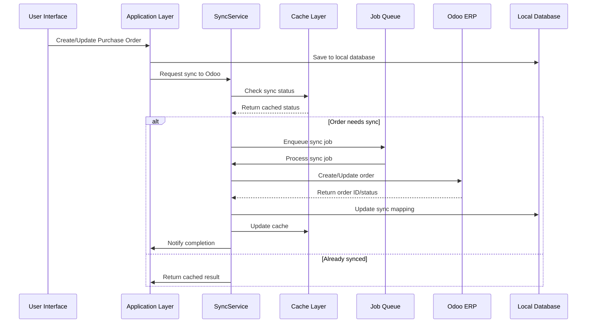
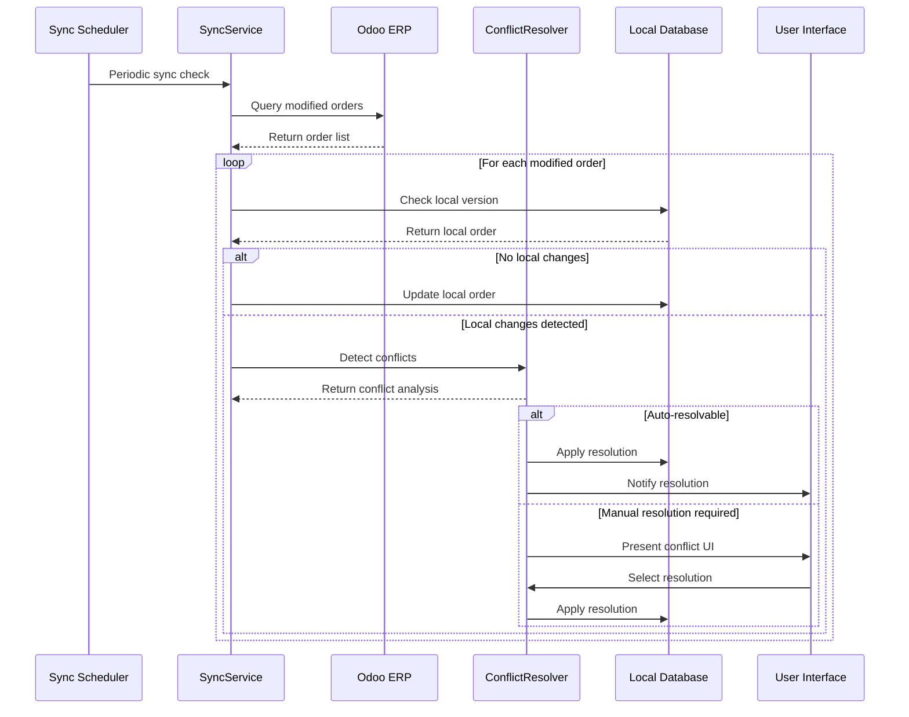
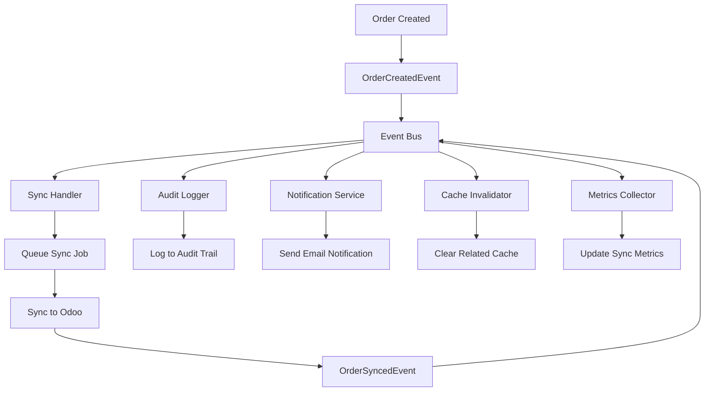
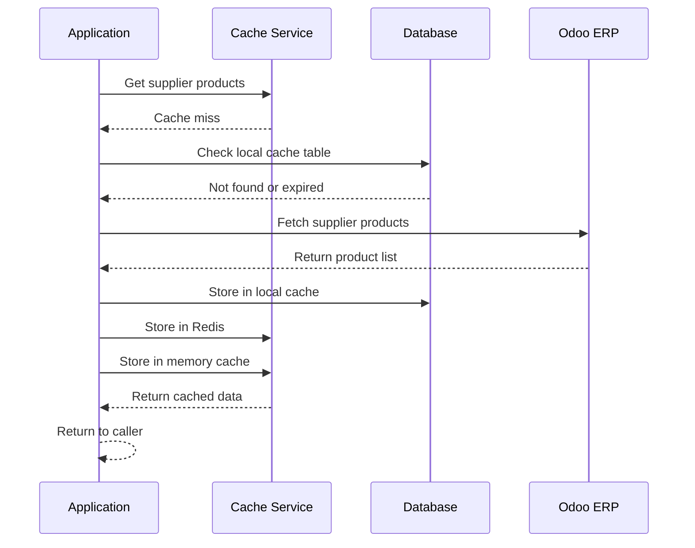
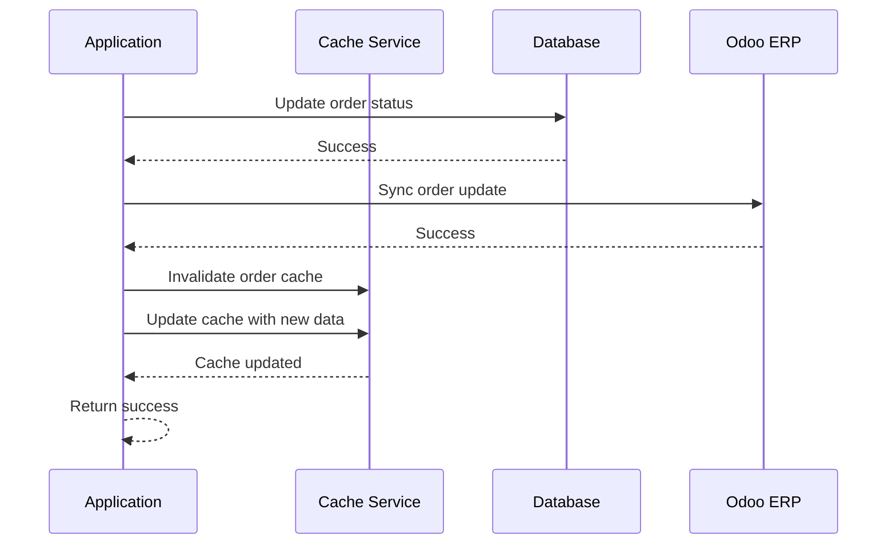
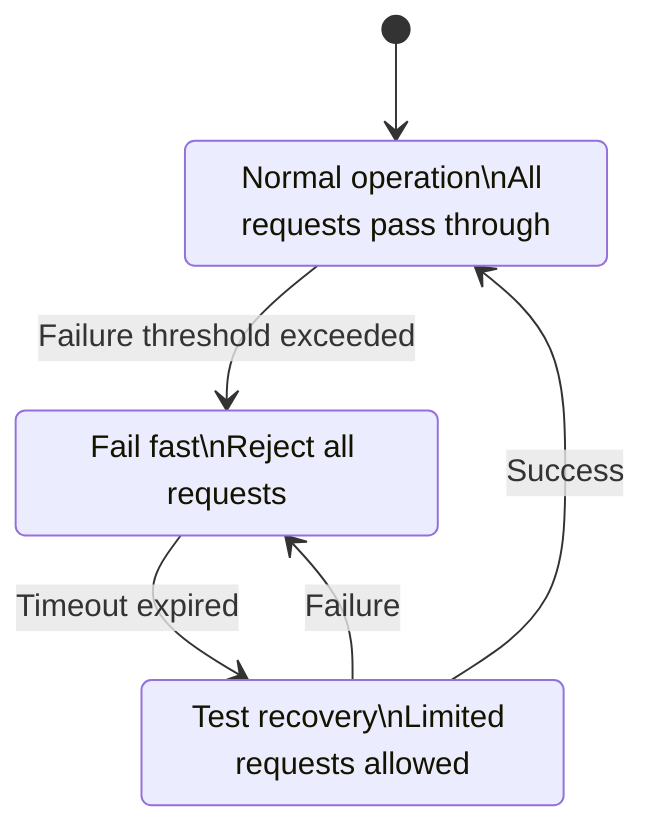
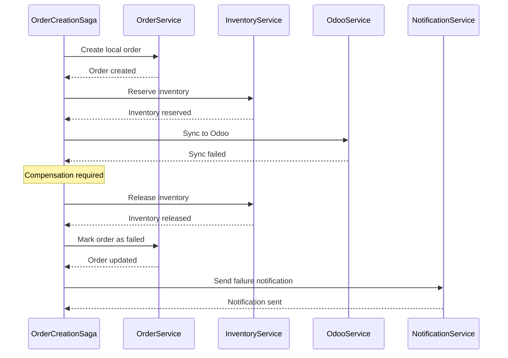

# Data Flow Patterns for Odoo Integration

## Overview

This document defines the data flow patterns for bidirectional synchronization between the Animal Farmacy application and Odoo ERP system. The patterns emphasize eventual consistency, conflict resolution, and robust error handling.

## Core Data Flow Patterns

### 1. Bidirectional Sync Flow

#### A. Local-to-Odoo Sync (Push Pattern)



#### B. Odoo-to-Local Sync (Pull Pattern)



### 2. Event-Driven Architecture Pattern

#### A. Domain Event Flow



#### B. Event Processing Pipeline

```typescript
interface EventPipeline {
  // Event Processing Stages
  validate(event: DomainEvent): Promise<ValidationResult>
  enrich(event: DomainEvent): Promise<EnrichedEvent>
  route(event: EnrichedEvent): Promise<RoutingDecision>
  process(event: EnrichedEvent, handlers: EventHandler[]): Promise<ProcessingResult>
  
  // Error Handling
  handleError(error: Error, event: DomainEvent): Promise<ErrorHandlingResult>
  retry(event: DomainEvent, attempt: number): Promise<RetryResult>
}

class OrderEventPipeline implements EventPipeline {
  async validate(event: DomainEvent): Promise<ValidationResult> {
    // Schema validation
    const schemaResult = await this.schemaValidator.validate(event)
    if (!schemaResult.valid) {
      return { valid: false, errors: schemaResult.errors }
    }
    
    // Business rule validation
    const businessResult = await this.businessValidator.validate(event)
    return businessResult
  }
  
  async enrich(event: DomainEvent): Promise<EnrichedEvent> {
    const enrichedEvent = { ...event }
    
    // Add correlation ID
    enrichedEvent.correlationId = this.generateCorrelationId()
    
    // Add user context
    enrichedEvent.userContext = await this.getUserContext(event.userId)
    
    // Add timestamp
    enrichedEvent.processedAt = new Date()
    
    return enrichedEvent
  }
  
  async route(event: EnrichedEvent): Promise<RoutingDecision> {
    const handlers: EventHandler[] = []
    
    switch (event.eventType) {
      case 'ORDER_CREATED':
        handlers.push(
          this.syncHandler,
          this.auditHandler,
          this.notificationHandler
        )
        break
        
      case 'ORDER_SYNCED':
        handlers.push(
          this.cacheInvalidationHandler,
          this.metricsHandler
        )
        break
        
      default:
        handlers.push(this.defaultHandler)
    }
    
    return {
      handlers,
      priority: this.getPriority(event),
      retryPolicy: this.getRetryPolicy(event)
    }
  }
}
```

### 3. Cache-Aside Pattern

#### A. Read-Through Cache Flow



#### B. Write-Through Cache Flow



### 4. Circuit Breaker Pattern

#### A. Circuit Breaker State Machine



#### B. Circuit Breaker Implementation

```typescript
class OdooCircuitBreaker {
  private state: 'CLOSED' | 'OPEN' | 'HALF_OPEN' = 'CLOSED'
  private failureCount = 0
  private lastFailureTime?: Date
  private nextAttemptTime?: Date
  
  constructor(
    private failureThreshold: number = 5,
    private recoveryTimeout: number = 60000, // 1 minute
    private halfOpenMaxCalls: number = 3
  ) {}
  
  async execute<T>(operation: () => Promise<T>): Promise<T> {
    if (this.state === 'OPEN') {
      if (this.shouldAttemptReset()) {
        this.state = 'HALF_OPEN'
        this.halfOpenCallCount = 0
      } else {
        throw new CircuitBreakerOpenError('Circuit breaker is OPEN')
      }
    }
    
    if (this.state === 'HALF_OPEN' && this.halfOpenCallCount >= this.halfOpenMaxCalls) {
      throw new CircuitBreakerOpenError('Half-open call limit exceeded')
    }
    
    try {
      const result = await operation()
      this.onSuccess()
      return result
    } catch (error) {
      this.onFailure(error)
      throw error
    }
  }
  
  private onSuccess(): void {
    this.failureCount = 0
    this.state = 'CLOSED'
    this.lastFailureTime = undefined
    this.nextAttemptTime = undefined
  }
  
  private onFailure(error: Error): void {
    this.failureCount++
    this.lastFailureTime = new Date()
    
    if (this.state === 'HALF_OPEN') {
      this.state = 'OPEN'
      this.nextAttemptTime = new Date(Date.now() + this.recoveryTimeout)
    } else if (this.failureCount >= this.failureThreshold) {
      this.state = 'OPEN'
      this.nextAttemptTime = new Date(Date.now() + this.recoveryTimeout)
    }
    
    // Log circuit breaker state change
    this.logger.warn('Circuit breaker failure', {
      state: this.state,
      failureCount: this.failureCount,
      error: error.message
    })
  }
}
```

### 5. Saga Pattern for Complex Transactions

#### A. Purchase Order Creation Saga



#### B. Saga Implementation

```typescript
abstract class Saga {
  protected steps: SagaStep[] = []
  protected compensations: Map<string, CompensationAction> = new Map()
  protected state: SagaState = { status: 'PENDING', completedSteps: [] }
  
  abstract defineSteps(): void
  
  async execute(): Promise<SagaResult> {
    this.defineSteps()
    
    try {
      for (const step of this.steps) {
        await this.executeStep(step)
        this.state.completedSteps.push(step.id)
      }
      
      this.state.status = 'COMPLETED'
      return { success: true, result: this.state }
      
    } catch (error) {
      this.state.status = 'FAILED'
      this.state.error = error
      
      // Execute compensations in reverse order
      await this.compensate()
      
      return { success: false, error, compensationResult: this.state }
    }
  }
  
  private async compensate(): Promise<void> {
    const completedSteps = [...this.state.completedSteps].reverse()
    
    for (const stepId of completedSteps) {
      const compensation = this.compensations.get(stepId)
      if (compensation) {
        try {
          await compensation.execute()
        } catch (compensationError) {
          this.logger.error('Compensation failed', {
            stepId,
            error: compensationError.message
          })
          // Continue with other compensations
        }
      }
    }
  }
}

class OrderCreationSaga extends Saga {
  constructor(
    private orderData: CreateOrderRequest,
    private orderService: IOrderService,
    private inventoryService: IInventoryService,
    private odooService: IOdooService,
    private notificationService: INotificationService
  ) {
    super()
  }
  
  defineSteps(): void {
    this.steps = [
      {
        id: 'CREATE_LOCAL_ORDER',
        action: () => this.orderService.createOrder(this.orderData)
      },
      {
        id: 'RESERVE_INVENTORY',
        action: () => this.inventoryService.reserveItems(this.orderData.items)
      },
      {
        id: 'SYNC_TO_ODOO',
        action: () => this.odooService.createOrder(this.orderData)
      }
    ]
    
    // Define compensations
    this.compensations.set('CREATE_LOCAL_ORDER', {
      execute: () => this.orderService.deleteOrder(this.state.orderId)
    })
    
    this.compensations.set('RESERVE_INVENTORY', {
      execute: () => this.inventoryService.releaseItems(this.orderData.items)
    })
    
    this.compensations.set('SYNC_TO_ODOO', {
      execute: () => this.odooService.cancelOrder(this.state.odooOrderId)
    })
  }
}
```

### 6. Conflict Resolution Patterns

#### A. Last-Writer-Wins with Version Control

```typescript
class VersionedConflictResolver implements IConflictResolver {
  async resolveConflict(conflict: SyncConflict): Promise<ConflictResolution> {
    const { localVersion, remoteVersion } = conflict
    
    // Compare version numbers
    if (localVersion.version > remoteVersion.version) {
      return {
        strategy: 'USE_LOCAL',
        result: localVersion,
        reason: 'Local version is newer'
      }
    } else if (remoteVersion.version > localVersion.version) {
      return {
        strategy: 'USE_REMOTE',
        result: remoteVersion,
        reason: 'Remote version is newer'
      }
    }
    
    // Same version, compare timestamps
    const localTime = new Date(localVersion.updatedAt)
    const remoteTime = new Date(remoteVersion.updatedAt)
    
    if (localTime > remoteTime) {
      return {
        strategy: 'USE_LOCAL',
        result: localVersion,
        reason: 'Local timestamp is newer'
      }
    } else {
      return {
        strategy: 'USE_REMOTE',
        result: remoteVersion,
        reason: 'Remote timestamp is newer'
      }
    }
  }
}
```

#### B. Business Rule Based Resolution

```typescript
class BusinessRuleConflictResolver implements IConflictResolver {
  private rules: ConflictResolutionRule[] = [
    {
      condition: (conflict) => conflict.field === 'status' && 
                              conflict.localValue === 'CANCELLED',
      resolution: 'USE_LOCAL',
      reason: 'Cancellation takes precedence'
    },
    {
      condition: (conflict) => conflict.field === 'totalAmount' && 
                              Math.abs(conflict.localValue - conflict.remoteValue) < 0.01,
      resolution: 'USE_LOCAL',
      reason: 'Amount difference is negligible'
    },
    {
      condition: (conflict) => conflict.field === 'items' && 
                              conflict.remoteValue.length > conflict.localValue.length,
      resolution: 'MERGE',
      reason: 'Merge additional items from remote'
    }
  ]
  
  async resolveConflict(conflict: SyncConflict): Promise<ConflictResolution> {
    for (const rule of this.rules) {
      if (rule.condition(conflict)) {
        if (rule.resolution === 'MERGE') {
          const mergedResult = await this.mergeConflict(conflict)
          return {
            strategy: 'MERGE',
            result: mergedResult,
            reason: rule.reason
          }
        }
        
        return {
          strategy: rule.resolution,
          result: rule.resolution === 'USE_LOCAL' ? 
                   conflict.localVersion : conflict.remoteVersion,
          reason: rule.reason
        }
      }
    }
    
    // No automatic resolution possible
    return {
      strategy: 'MANUAL_RESOLUTION_REQUIRED',
      result: null,
      reason: 'No automatic resolution rule applies'
    }
  }
  
  private async mergeConflict(conflict: SyncConflict): Promise<any> {
    // Implement field-specific merge logic
    switch (conflict.field) {
      case 'items':
        return this.mergeOrderItems(conflict.localVersion, conflict.remoteVersion)
      
      case 'notes':
        return this.mergeTextFields(conflict.localVersion, conflict.remoteValue)
        
      default:
        throw new Error(`No merge strategy for field: ${conflict.field}`)
    }
  }
}
```

### 7. Performance Optimization Patterns

#### A. Batch Processing Pattern

```typescript
class BatchProcessor<T, R> {
  constructor(
    private batchSize: number = 100,
    private processingDelay: number = 1000,
    private processor: (items: T[]) => Promise<R[]>
  ) {}
  
  async processItems(items: T[]): Promise<R[]> {
    const results: R[] = []
    
    for (let i = 0; i < items.length; i += this.batchSize) {
      const batch = items.slice(i, i + this.batchSize)
      
      try {
        const batchResults = await this.processor(batch)
        results.push(...batchResults)
        
        // Add delay between batches to avoid overwhelming the system
        if (i + this.batchSize < items.length) {
          await this.delay(this.processingDelay)
        }
        
      } catch (error) {
        this.logger.error('Batch processing failed', {
          batchStart: i,
          batchSize: batch.length,
          error: error.message
        })
        
        // Process items individually for this batch
        const individualResults = await this.processIndividually(batch)
        results.push(...individualResults)
      }
    }
    
    return results
  }
  
  private async processIndividually(items: T[]): Promise<R[]> {
    const results: R[] = []
    
    for (const item of items) {
      try {
        const result = await this.processor([item])
        results.push(...result)
      } catch (error) {
        this.logger.error('Individual item processing failed', {
          item,
          error: error.message
        })
        // Continue with next item
      }
    }
    
    return results
  }
  
  private delay(ms: number): Promise<void> {
    return new Promise(resolve => setTimeout(resolve, ms))
  }
}
```

#### B. Connection Pooling Pattern

```typescript
class OdooConnectionPool {
  private connections: OdooConnection[] = []
  private activeConnections = 0
  private waitQueue: Array<{
    resolve: (connection: OdooConnection) => void
    reject: (error: Error) => void
  }> = []
  
  constructor(
    private maxConnections: number = 10,
    private connectionTimeout: number = 30000,
    private idleTimeout: number = 300000 // 5 minutes
  ) {}
  
  async getConnection(): Promise<OdooConnection> {
    // Try to get available connection
    const availableConnection = this.connections.find(conn => !conn.inUse)
    if (availableConnection) {
      availableConnection.inUse = true
      availableConnection.lastUsed = new Date()
      return availableConnection
    }
    
    // Create new connection if under limit
    if (this.activeConnections < this.maxConnections) {
      const newConnection = await this.createConnection()
      this.connections.push(newConnection)
      this.activeConnections++
      return newConnection
    }
    
    // Wait for available connection
    return new Promise((resolve, reject) => {
      const timeoutHandle = setTimeout(() => {
        const index = this.waitQueue.findIndex(item => 
          item.resolve === resolve && item.reject === reject
        )
        if (index > -1) {
          this.waitQueue.splice(index, 1)
        }
        reject(new Error('Connection pool timeout'))
      }, this.connectionTimeout)
      
      this.waitQueue.push({
        resolve: (connection) => {
          clearTimeout(timeoutHandle)
          resolve(connection)
        },
        reject: (error) => {
          clearTimeout(timeoutHandle)
          reject(error)
        }
      })
    })
  }
  
  releaseConnection(connection: OdooConnection): void {
    connection.inUse = false
    connection.lastUsed = new Date()
    
    // Serve waiting requests
    const waiter = this.waitQueue.shift()
    if (waiter) {
      connection.inUse = true
      waiter.resolve(connection)
    }
  }
  
  private async createConnection(): Promise<OdooConnection> {
    const connection = new OdooConnection(this.config)
    await connection.authenticate()
    
    connection.inUse = true
    connection.lastUsed = new Date()
    connection.createdAt = new Date()
    
    return connection
  }
  
  async cleanup(): Promise<void> {
    const now = new Date()
    const connectionsToClose = this.connections.filter(conn => 
      !conn.inUse && (now.getTime() - conn.lastUsed.getTime()) > this.idleTimeout
    )
    
    for (const connection of connectionsToClose) {
      try {
        await connection.close()
        this.connections = this.connections.filter(c => c !== connection)
        this.activeConnections--
      } catch (error) {
        this.logger.error('Error closing idle connection', { error: error.message })
      }
    }
  }
}
```

## Summary

These data flow patterns provide a comprehensive foundation for robust Odoo integration:

1. **Bidirectional Sync**: Handles both push and pull scenarios with conflict detection
2. **Event-Driven Architecture**: Enables loose coupling and extensibility
3. **Circuit Breaker**: Provides resilience against service failures
4. **Saga Pattern**: Manages complex distributed transactions
5. **Conflict Resolution**: Handles data inconsistencies gracefully
6. **Performance Optimization**: Ensures scalability through batching and pooling

Each pattern is designed to be testable, maintainable, and follows clean architecture principles.