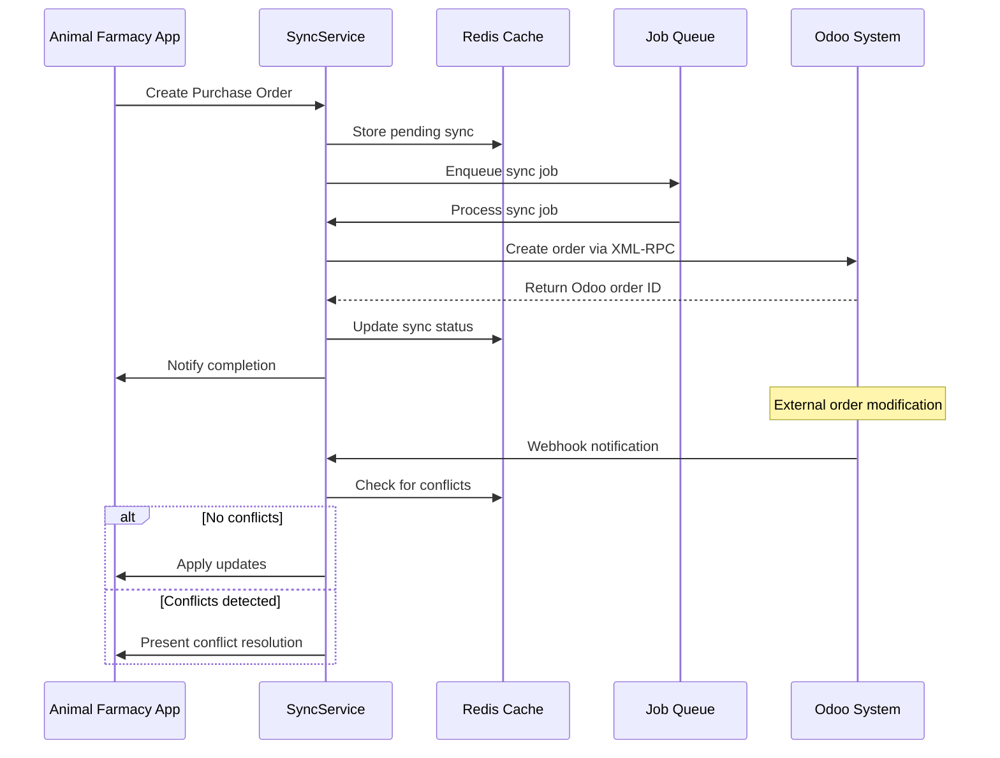
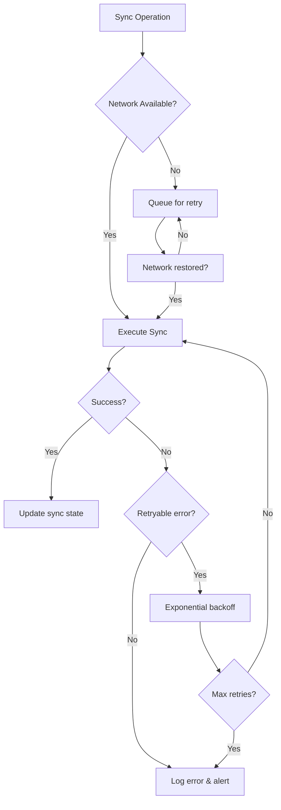

# Odoo Integration Architecture Design

## Executive Summary

This document defines the comprehensive architecture for bidirectional Odoo purchase order synchronization in the Animal Farmacy application. The design emphasizes Test-Driven Development (TDD) principles, clean architecture patterns, and robust error handling for enterprise-grade integration.

## Current State Analysis

### Existing Architecture
- **Database**: PostgreSQL with Supabase, using UUID-based entities
- **Current Odoo Integration**: Basic XML-RPC connection via edge functions
- **Order Management**: Local `orders` and `order_items` tables
- **Supplier Integration**: Existing Odoo supplier fetching via `useOdooSuppliers` hook
- **MCP Integration**: Async Odoo MCP client with connection pooling

### Identified Gaps
1. **No bidirectional sync** - Local orders are not synchronized to Odoo
2. **Limited error handling** - Basic retry mechanisms only
3. **No caching layer** - Direct API calls without performance optimization
4. **Missing conflict resolution** - No handling of concurrent modifications
5. **No batch operations** - Individual API calls for bulk operations

## Architectural Principles

### 1. Domain-Driven Design (DDD)
- **Purchase Order Aggregate**: Central business entity managing order lifecycle
- **Supplier Aggregate**: Managing supplier relationships and product catalogs
- **Sync Aggregate**: Handling synchronization state and conflict resolution

### 2. Clean Architecture Layers
```
┌─────────────────────────────────────────┐
│             Presentation Layer           │
│   (React Components, API Routes)        │
├─────────────────────────────────────────┤
│            Application Layer             │
│   (Use Cases, Command/Query Handlers)   │
├─────────────────────────────────────────┤
│              Domain Layer                │
│    (Entities, Value Objects, Events)    │
├─────────────────────────────────────────┤
│           Infrastructure Layer           │
│  (Odoo Client, Database, Cache, Queue)  │
└─────────────────────────────────────────┘
```

### 3. CQRS (Command Query Responsibility Segregation)
- **Commands**: Create, Update, Delete operations with strong consistency
- **Queries**: Read operations with eventual consistency and caching
- **Events**: Domain events for async processing and notifications

## Core Architecture Components

### 1. Service Layer Design

#### A. OdooIntegrationService
**Purpose**: Central orchestrator for all Odoo operations

```typescript
interface IOdooIntegrationService {
  // Purchase Order Sync
  syncPurchaseOrderToOdoo(localOrderId: string): Promise<SyncResult>
  syncPurchaseOrderFromOdoo(odooOrderId: number): Promise<SyncResult>
  
  // Batch Operations  
  batchSyncPendingOrders(): Promise<BatchSyncResult>
  
  // Real-time Sync
  startRealtimeSync(): Promise<void>
  stopRealtimeSync(): Promise<void>
  
  // Health & Status
  getHealthStatus(): Promise<IntegrationHealthStatus>
}
```

#### B. OdooPurchaseOrderRepository
**Purpose**: Data access and transformation layer

```typescript
interface IOdooPurchaseOrderRepository {
  // CRUD Operations
  createOdooOrder(order: PurchaseOrder): Promise<number>
  updateOdooOrder(odooId: number, updates: Partial<PurchaseOrder>): Promise<void>
  getOdooOrder(odooId: number): Promise<OdooPurchaseOrder | null>
  
  // Sync Operations
  findOrdersModifiedSince(timestamp: Date): Promise<OdooPurchaseOrder[]>
  markOrderAsSynced(localId: string, odooId: number): Promise<void>
  
  // Conflict Resolution
  detectConflicts(localOrder: PurchaseOrder, odooOrder: OdooPurchaseOrder): ConflictSet
}
```

#### C. SyncStateManager
**Purpose**: Track synchronization state and handle conflicts

```typescript
interface ISyncStateManager {
  // State Management
  getSyncState(entityId: string): Promise<SyncState>
  updateSyncState(entityId: string, state: SyncState): Promise<void>
  
  // Conflict Resolution
  resolveConflict(conflict: SyncConflict, resolution: ConflictResolution): Promise<void>
  getPendingConflicts(): Promise<SyncConflict[]>
  
  // Health Monitoring
  getLastSuccessfulSync(): Promise<Date>
  getFailedSyncCount(): Promise<number>
}
```

### 2. Data Flow Patterns

#### A. Bidirectional Sync Flow


#### B. Error Handling & Retry Pattern


### 3. Caching & Performance Optimization

#### A. Multi-Level Caching Strategy
```typescript
interface CacheStrategy {
  // L1: In-memory cache (fastest, limited size)
  memoryCache: MemoryCache<string, any>
  
  // L2: Redis cache (fast, shared across instances)
  redisCache: RedisCache
  
  // L3: Database cache (slower, persistent)
  dbCache: DatabaseCache
}

// Cache hierarchy
class HierarchicalCache {
  async get<T>(key: string): Promise<T | null> {
    // Try L1 first
    let value = await this.memoryCache.get<T>(key)
    if (value) return value
    
    // Try L2 second
    value = await this.redisCache.get<T>(key)
    if (value) {
      await this.memoryCache.set(key, value, TTL_SHORT)
      return value
    }
    
    // Try L3 last
    value = await this.dbCache.get<T>(key)
    if (value) {
      await this.redisCache.set(key, value, TTL_MEDIUM)
      await this.memoryCache.set(key, value, TTL_SHORT)
      return value
    }
    
    return null
  }
}
```

#### B. Cache Invalidation Strategy
- **Write-through**: Immediate cache update on data modification
- **TTL-based**: Time-based expiration for supplier/product data
- **Event-driven**: Cache invalidation based on domain events

### 4. Error Handling & Retry Strategies

#### A. Error Classification System
```typescript
enum ErrorType {
  // Transient errors (retry automatically)
  NETWORK_TIMEOUT = 'NETWORK_TIMEOUT',
  CONNECTION_REFUSED = 'CONNECTION_REFUSED', 
  RATE_LIMIT_EXCEEDED = 'RATE_LIMIT_EXCEEDED',
  
  // Permanent errors (manual intervention required)
  AUTHENTICATION_FAILED = 'AUTHENTICATION_FAILED',
  INVALID_CREDENTIALS = 'INVALID_CREDENTIALS',
  DATA_VALIDATION_FAILED = 'DATA_VALIDATION_FAILED',
  
  // Business errors (user action required)
  INSUFFICIENT_STOCK = 'INSUFFICIENT_STOCK',
  DUPLICATE_ORDER = 'DUPLICATE_ORDER',  
  INVALID_SUPPLIER = 'INVALID_SUPPLIER'
}

interface ErrorHandler {
  classify(error: Error): ErrorType
  shouldRetry(errorType: ErrorType, attemptCount: number): boolean
  getRetryDelay(attemptCount: number): number
  notifyStakeholders(error: Error, context: SyncContext): Promise<void>
}
```

#### B. Circuit Breaker Pattern
```typescript
class CircuitBreaker {
  private state: 'CLOSED' | 'OPEN' | 'HALF_OPEN' = 'CLOSED'
  private failureCount = 0
  private lastFailureTime?: Date
  
  async execute<T>(operation: () => Promise<T>): Promise<T> {
    if (this.state === 'OPEN') {
      if (this.shouldAttemptReset()) {
        this.state = 'HALF_OPEN'
      } else {
        throw new Error('Circuit breaker is OPEN')
      }
    }
    
    try {
      const result = await operation()
      this.onSuccess()
      return result
    } catch (error) {
      this.onFailure()
      throw error
    }
  }
  
  private onSuccess(): void {
    this.failureCount = 0
    this.state = 'CLOSED'
  }
  
  private onFailure(): void {
    this.failureCount++
    this.lastFailureTime = new Date()
    
    if (this.failureCount >= this.failureThreshold) {
      this.state = 'OPEN'
    }
  }
}
```

## TDD-Friendly Design Patterns

### 1. Dependency Injection & Interface Segregation
```typescript
// Interfaces for easy mocking in tests
interface IOdooClient {
  createOrder(order: CreateOrderRequest): Promise<number>
  updateOrder(id: number, updates: UpdateOrderRequest): Promise<void>
  getOrder(id: number): Promise<OdooOrder | null>
}

interface IEventBus {
  publish(event: DomainEvent): Promise<void>
  subscribe<T extends DomainEvent>(eventType: string, handler: EventHandler<T>): void
}

// Service with injected dependencies  
class PurchaseOrderSyncService {
  constructor(
    private odooClient: IOdooClient,
    private eventBus: IEventBus,
    private syncStateManager: ISyncStateManager,
    private conflictResolver: IConflictResolver
  ) {}
  
  async syncToOdoo(order: PurchaseOrder): Promise<SyncResult> {
    // Implementation with full testability
  }
}
```

### 2. Test Doubles & Mock Strategies
```typescript
// Test implementation
class MockOdooClient implements IOdooClient {
  private orders = new Map<number, OdooOrder>()
  private nextId = 1
  
  async createOrder(order: CreateOrderRequest): Promise<number> {
    const id = this.nextId++
    this.orders.set(id, { id, ...order, state: 'draft' })
    return id
  }
  
  // Simulate network errors for error handling tests
  async simulateNetworkError(): void {
    throw new Error('Connection timeout')
  }
}

// Usage in tests
describe('PurchaseOrderSyncService', () => {
  let service: PurchaseOrderSyncService
  let mockOdooClient: MockOdooClient
  
  beforeEach(() => {
    mockOdooClient = new MockOdooClient()
    service = new PurchaseOrderSyncService(mockOdooClient, ...)
  })
  
  it('should create order in Odoo when syncing new purchase order', async () => {
    // Test implementation
  })
})
```

### 3. Domain Event Testing
```typescript
// Event-driven testing approach
describe('Purchase Order Domain Events', () => {
  it('should publish OrderCreated event when order is created', async () => {
    const eventSpy = jest.fn()
    eventBus.subscribe('OrderCreated', eventSpy)
    
    await purchaseOrderService.createOrder(orderData)
    
    expect(eventSpy).toHaveBeenCalledWith(
      expect.objectContaining({
        type: 'OrderCreated',
        data: expect.objectContaining({ orderId: expect.any(String) })
      })
    )
  })
})
```

## Implementation Roadmap

### Phase 1: Foundation (Weeks 1-2)
- [ ] Create domain entities and value objects
- [ ] Implement basic repository interfaces  
- [ ] Set up dependency injection container
- [ ] Create comprehensive test suite structure

### Phase 2: Core Integration (Weeks 3-4)
- [ ] Implement OdooIntegrationService with basic CRUD
- [ ] Add error handling and retry mechanisms
- [ ] Create sync state management
- [ ] Implement cache layer

### Phase 3: Advanced Features (Weeks 5-6)
- [ ] Add conflict resolution system
- [ ] Implement batch sync operations
- [ ] Create real-time sync via webhooks
- [ ] Add monitoring and alerting

### Phase 4: Optimization (Weeks 7-8)  
- [ ] Performance tuning and optimization
- [ ] Comprehensive integration testing
- [ ] Documentation and deployment guides
- [ ] Production readiness checklist

## Quality Assurance Strategy

### 1. Testing Pyramid
```
        /\
       /  \
      / UI \           (Few, Slow, Expensive)
     /______\
    /        \
   /Integration\      (Some, Medium, Moderate)
  /____________\
 /              \
/  Unit Tests    \    (Many, Fast, Cheap)
\________________/
```

### 2. Test Coverage Requirements
- **Unit Tests**: 95% code coverage minimum
- **Integration Tests**: All external service interactions  
- **End-to-End Tests**: Critical user journeys
- **Performance Tests**: Load and stress testing

### 3. Continuous Integration Pipeline
1. **Pre-commit**: Linting, type checking, unit tests
2. **PR Validation**: Integration tests, security scans
3. **Staging Deploy**: E2E tests, performance validation
4. **Production Deploy**: Blue-green deployment with rollback

## Monitoring & Observability

### 1. Key Metrics
- **Sync Success Rate**: Percentage of successful synchronizations
- **Sync Latency**: Time from local change to Odoo sync completion
- **Error Rate**: Rate of sync failures by error type
- **Conflict Rate**: Frequency of sync conflicts requiring resolution

### 2. Alerting Strategy
- **Critical**: Authentication failures, service unavailability
- **Warning**: High error rates, sync delays
- **Info**: Successful bulk operations, maintenance events

### 3. Logging Standards
```typescript
interface SyncLogEntry {
  timestamp: Date
  level: 'DEBUG' | 'INFO' | 'WARN' | 'ERROR'
  operation: string
  entityType: string
  entityId: string
  odooId?: number
  duration?: number
  error?: Error
  metadata?: Record<string, any>
}
```

## Security Considerations

### 1. Authentication & Authorization
- **Service Account**: Dedicated Odoo user for API access
- **Token Management**: Secure storage and rotation of credentials
- **Permission Boundaries**: Minimal required permissions principle

### 2. Data Protection
- **Encryption**: TLS for data in transit, AES for sensitive data at rest
- **PII Handling**: Minimal customer data exposure in logs/cache  
- **Audit Trail**: Complete log of all data modifications

### 3. Network Security
- **API Rate Limiting**: Prevent abuse and ensure fair usage
- **IP Whitelisting**: Restrict access to known application servers
- **Webhook Validation**: Verify webhook signatures for authenticity

## Conclusion

This architecture provides a robust, scalable, and maintainable foundation for Odoo purchase order integration. The emphasis on TDD principles, clean architecture patterns, and comprehensive error handling ensures long-term success and easy maintenance.

The modular design allows for incremental implementation and testing, while the separation of concerns enables individual components to be developed, tested, and deployed independently.

---

**Document Version**: 1.0  
**Last Updated**: 2025-08-03  
**Author**: System Architecture Agent  
**Review Status**: Draft