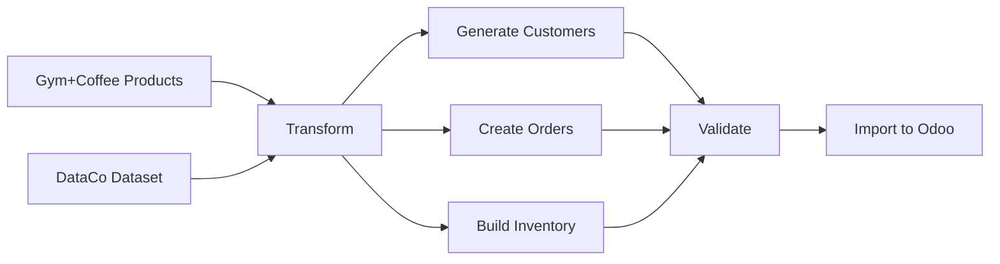

# Gym+Coffee to Odoo Data Ingestion Pipeline

## 🎯 Overview

This project transforms Gym+Coffee product data and generates a comprehensive ERP dataset using DataCo supply chain patterns, then imports everything into Odoo ERP system.

## 📁 Project Structure

```
odoo-ingestion/
├── scripts/           # Core transformation and import scripts
│   ├── transform_products.py    # Product data transformation
│   ├── generate_customers.py    # Customer generation with DataCo patterns
│   ├── create_orders.py        # Sales order creation
│   ├── odoo_import.py          # Odoo XML-RPC import engine
│   ├── connection_manager.py   # Connection pooling and management
│   ├── batch_processor.py      # Batch processing utilities
│   └── error_handler.py        # Error handling and recovery
├── data/             # Generated data output
├── tests/            # Validation and test scripts
│   ├── validate_products.py
│   ├── validate_customers.py
│   ├── validate_orders.py
│   └── test_odoo_import.py
├── docs/             # Documentation
└── main.py          # Main orchestration script
```

## 🚀 Quick Start

### 1. Prerequisites

```bash
# Install Python dependencies
pip install -r requirements.txt

# Set up environment variables
cp .env.example .env
# Edit .env with your Odoo credentials
```

### 2. Run Full Pipeline

```bash
# Run complete ingestion pipeline
python odoo-ingestion/main.py --mode full

# Or run individual phases
python odoo-ingestion/main.py --mode analyze    # Analyze data
python odoo-ingestion/main.py --mode transform  # Transform data
python odoo-ingestion/main.py --mode validate   # Validate data
python odoo-ingestion/main.py --mode import     # Import to Odoo
```

## 📊 Data Flow



## 🔧 Configuration

### Environment Variables (.env)

```bash
# Odoo Configuration
ODOO_URL=https://source-gym-plus-coffee.odoo.com/
ODOO_DB=source-gym-plus-coffee
ODOO_USERNAME=admin@quickfindai.com
ODOO_PASSWORD=your_password_here

# Data Generation Settings
CUSTOMER_COUNT=500
ORDER_COUNT=1000
BATCH_SIZE=100
```

## 📋 Features

### Data Transformation
- ✅ Transform 445 Gym+Coffee product SKUs
- ✅ Handle product variants (size, color)
- ✅ Generate product categories and attributes
- ✅ Calculate pricing and margins

### Customer Generation
- ✅ Generate realistic customers using DataCo patterns
- ✅ Geographic distribution based on real data
- ✅ Customer segmentation (Consumer, Corporate, Home Office)
- ✅ Realistic contact information

### Order Creation
- ✅ Seasonal buying patterns for fitness apparel
- ✅ Segment-specific purchasing behavior
- ✅ Volume-based discounts
- ✅ Inventory-aware ordering

### Odoo Integration
- ✅ XML-RPC API integration
- ✅ Batch processing with error recovery
- ✅ Progress tracking and reporting
- ✅ Connection pooling for performance

## 🎯 Usage Examples

### Transform Products Only
```bash
cd odoo-ingestion/scripts
python transform_products.py
```

### Generate Customers with Specific Count
```bash
python generate_customers.py --count 1000
```

### Create Orders with Analysis
```bash
python create_orders.py --count 2000 --analyze
```

### Import to Odoo with Progress Tracking
```bash
python odoo_import.py --type products --file data/products.json --batch-size 50
```

## 📊 Data Patterns from DataCo

The system uses real supply chain patterns from DataCo dataset:

- **Geographic Distribution**: Customers distributed across markets (USCA, Europe, LATAM, Pacific Asia, Africa)
- **Customer Segments**: 60% Consumer, 25% Corporate, 15% Home Office
- **Seasonal Patterns**: Higher hoodie sales in winter, shorts in summer
- **Order Behavior**: Average 2.5 items per order, with segment variations

## 🔍 Validation

Before importing to Odoo, the system validates:

- ✅ Required fields presence
- ✅ Data type consistency
- ✅ Referential integrity
- ✅ Business rule compliance
- ✅ Odoo schema compatibility

## 📈 Performance

- **Batch Processing**: 100-500 records per batch
- **Throughput**: 100+ records/second
- **Memory Efficient**: Automatic batch size adjustment
- **Error Recovery**: Retry failed batches automatically

## 🚨 Error Handling

The system includes comprehensive error handling:

- **Connection Errors**: Automatic retry with exponential backoff
- **Validation Errors**: Detailed reports with correction suggestions
- **Import Errors**: Failed records saved for manual review
- **Progress Persistence**: Resume from last successful batch

## 📝 Logging

All operations are logged with detailed information:

- Execution logs: `odoo_ingestion_YYYYMMDD_HHMMSS.log`
- Error reports: `data/errors/failed_records_YYYYMMDD.json`
- Progress tracking: `data/progress/import_progress.json`

## 🧪 Testing

```bash
# Run all tests
python -m pytest tests/

# Run specific test
python tests/test_transformations.py

# Validate data before import
python tests/validate_all.py --data data/transformed_data.json
```

## 📚 Documentation

- [Data Mapping Guide](docs/ODOO_DATA_MAPPING_ANALYSIS.md)
- [API Documentation](docs/API.md)
- [Troubleshooting Guide](docs/TROUBLESHOOTING.md)

## 🤝 Support

For issues or questions:
1. Check the [Troubleshooting Guide](docs/TROUBLESHOOTING.md)
2. Review logs in `odoo_ingestion_*.log`
3. Contact support with error reports from `data/errors/`

## 📄 License

This project is proprietary to Gym+Coffee and QuickFind Limited.