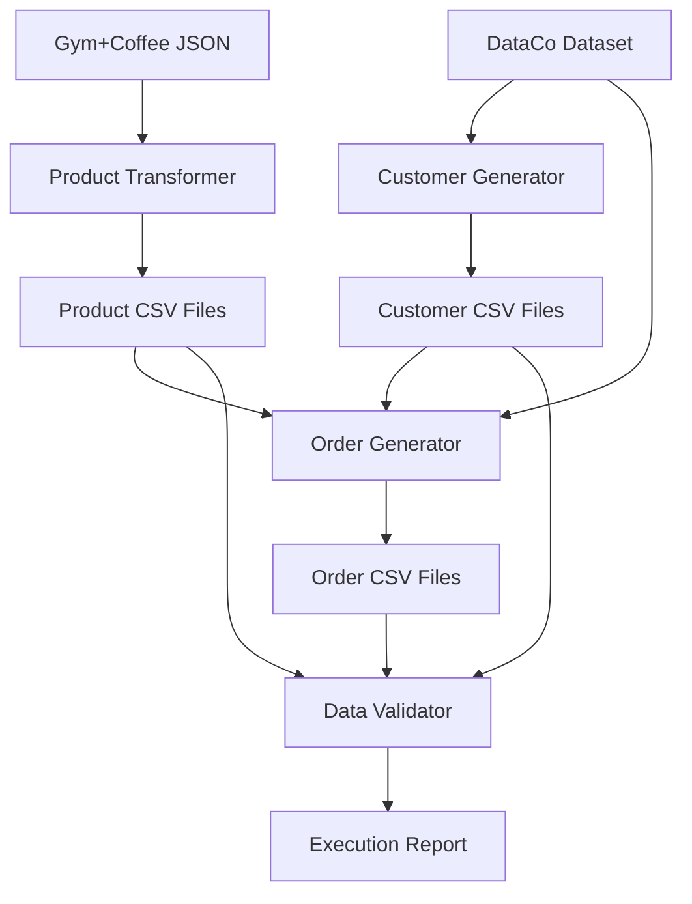

# Gym+Coffee to Odoo Data Transformation Scripts

This directory contains Python scripts for transforming Gym+Coffee product data and generating realistic test data for Odoo integration, based on patterns from the DataCo Supply Chain dataset.

## 🚀 Overview

The transformation pipeline consists of four main components:

1. **Product Transformation** (`transform_products.py`) - Converts Gym+Coffee product JSON to Odoo format
2. **Customer Generation** (`generate_customers.py`) - Creates realistic customers using DataCo patterns
3. **Order Creation** (`create_orders.py`) - Generates sales orders with proper relationships
4. **Pipeline Orchestration** (`data_pipeline.py`) - Runs complete transformation workflow

## 📋 Prerequisites

### Python Environment
```bash
# Create virtual environment
python -m venv venv
source venv/bin/activate  # On Windows: venv\Scripts\activate

# Install required packages
pip install -r requirements.txt
```

### Required Data Files
Ensure these files exist in the correct locations:

```
data/
├── gym_plus_coffee_products.json    # Source product catalog
└── dataco/
    └── DataCoSupplyChainDataset.csv  # DataCo supply chain data
```

## 🔧 Usage

### Option 1: Full Pipeline (Recommended)

Run the complete transformation pipeline:

```bash
python data_pipeline.py --full-pipeline
```

This will:
- Transform all products to Odoo format
- Generate 1,000 customers based on DataCo patterns
- Create 2,000 realistic sales orders
- Validate data integrity
- Generate comprehensive reports

### Option 2: Individual Components

Run individual transformation steps:

```bash
# Transform products only
python transform_products.py --source ../data/gym_plus_coffee_products.json

# Generate customers only (requires DataCo data)
python generate_customers.py --dataco ../data/dataco/DataCoSupplyChainDataset.csv --count 1000

# Generate orders only (requires customers and products)
python create_orders.py --customers ../data/transformed/odoo_customers.csv \
                       --products ../data/transformed/odoo_product_variants.csv \
                       --count 2000

# Run data validation
python data_pipeline.py --validate-only
```

### Option 3: Custom Configuration

Create a custom configuration file:

```json
{
  "base_dir": "../..",
  "output_dir": "../data/transformed",
  "num_customers": 2000,
  "num_orders": 5000,
  "validation_enabled": true,
  "generate_reports": true
}
```

Then run with custom config:
```bash
python data_pipeline.py --config my_config.json --full-pipeline
```

## 📊 Output Files

The transformation pipeline generates the following CSV files for Odoo import:

### Product Data
- `odoo_product_categories.csv` - Product categories hierarchy
- `odoo_product_attributes.csv` - Product attributes (Color, Size)
- `odoo_product_attribute_values.csv` - Attribute values
- `odoo_product_templates.csv` - Product templates (grouped variants)
- `odoo_product_variants.csv` - Individual product variants
- `odoo_inventory_initial.csv` - Initial inventory levels

### Customer Data
- `odoo_customers.csv` - Customer records (res.partner)
- `odoo_customer_categories.csv` - Customer segmentation categories

### Sales Data
- `odoo_sales_orders.csv` - Sales order headers
- `odoo_order_lines.csv` - Sales order line items
- `odoo_stock_moves.csv` - Inventory movements

### Reports
- `pipeline_execution_report.json` - Comprehensive execution report
- `transformation_summary.json` - Product transformation summary
- `customer_generation_summary.json` - Customer generation summary
- `orders_generation_summary.json` - Order generation summary

## 🧪 Data Generation Features

### Product Transformation
- Converts JSON product catalog to Odoo-compatible CSV format
- Groups variants by base product name
- Creates proper category hierarchies
- Generates barcodes and product codes
- Maintains inventory levels and costing data

### Customer Generation (DataCo-based)
- Analyzes geographic patterns from real DataCo data
- Maintains realistic country/state/city distributions
- Applies proper customer segmentation (Consumer/Corporate/Home Office)
- Generates realistic contact information using Faker
- Creates spending patterns based on segment analysis

### Order Generation (DataCo-based)
- Uses DataCo seasonal patterns for product selection
- Applies realistic quantity distributions
- Implements segment-based discount patterns
- Creates proper shipping method distributions
- Maintains referential integrity across all relationships

## 📈 Data Patterns & Analytics

The scripts implement sophisticated pattern recognition from the DataCo dataset:

### Geographic Distribution
- Customer locations based on actual DataCo country/state distributions
- Proper address generation using locale-specific Faker instances

### Seasonal Patterns
- Fitness apparel seasonal buying patterns (e.g., hoodies in winter, shorts in summer)
- Monthly order distribution based on DataCo historical data

### Customer Behavior
- Segment-specific spending patterns
- Corporate vs. Consumer purchasing behavior
- Realistic order frequency and size distributions

### Business Logic
- Volume discounts for larger orders
- Segment-based credit limits and payment terms
- Inventory availability impacts on product selection

## 🔍 Data Validation

The pipeline includes comprehensive data validation:

### Integrity Checks
- External ID uniqueness
- Required field validation
- Price and quantity range validation
- Email format validation

### Relationship Validation
- Customer references in orders
- Product references in order lines
- Order references in order lines
- Parent-child category relationships

### Business Rule Validation
- Order totals match line item totals
- Inventory levels are non-negative
- Discount percentages within reasonable ranges

## 🧪 Testing

Run the test suite to validate functionality:

```bash
# Run all tests
python test_transformations.py

# Run basic functionality test only
python test_transformations.py -v
```

Tests include:
- Product transformation accuracy
- Customer generation patterns
- Order relationship integrity
- CSV file structure validation

## ⚙️ Configuration Options

### Command Line Arguments

All scripts support these common arguments:
- `--output` - Output directory path
- `--help` - Show detailed usage information

Script-specific arguments:
- `transform_products.py --source` - Source JSON file path
- `generate_customers.py --count` - Number of customers to generate
- `create_orders.py --count` - Number of orders to generate

### Environment Variables

Set these environment variables for custom behavior:
- `ODOO_DATA_OUTPUT_DIR` - Default output directory
- `DATACO_DATASET_PATH` - Path to DataCo dataset

## 🐛 Troubleshooting

### Common Issues

1. **Missing Source Files**
   ```
   Error: File not found: data/gym_plus_coffee_products.json
   ```
   Ensure the source data files exist in the expected locations.

2. **Import Errors**
   ```
   ModuleNotFoundError: No module named 'pandas'
   ```
   Install required packages: `pip install -r requirements.txt`

3. **Memory Issues with Large Datasets**
   Reduce the number of generated records:
   ```bash
   python data_pipeline.py --num-customers 500 --num-orders 1000
   ```

4. **Invalid DataCo File**
   ```
   Error: 'latin-1' codec can't decode byte
   ```
   Ensure the DataCo CSV file uses proper encoding. Try converting to UTF-8.

### Debug Mode

Enable verbose logging for debugging:
```python
import logging
logging.basicConfig(level=logging.DEBUG)
```

## 📝 Data Schema

### Product Schema (Odoo product.product)
```csv
external_id,default_code,name,list_price,standard_price,category_id,qty_available,barcode
```

### Customer Schema (Odoo res.partner)
```csv
external_id,name,email,phone,street,city,state_id,country_id,customer_rank,category_id
```

### Order Schema (Odoo sale.order)
```csv
external_id,partner_id,date_order,state,amount_total,customer_segment,shipping_mode
```

## 🔄 Pipeline Architecture



## 📚 Additional Resources

- [Odoo Data Import Documentation](https://www.odoo.com/documentation/15.0/applications/general/export_import_data.html)
- [DataCo Supply Chain Dataset](https://data.mendeley.com/datasets/8gx2fvg2k6/5)
- [Faker Documentation](https://faker.readthedocs.io/en/master/)

## 🤝 Contributing

To contribute to this project:

1. Follow PEP 8 style guidelines
2. Add unit tests for new functionality
3. Update documentation for new features
4. Ensure all existing tests pass

## 📄 License

This project is part of the Gym+Coffee Odoo integration and follows the same license terms as the main project.