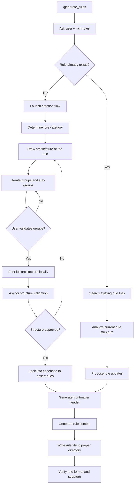

# Agent `generate_rules`

## Goal

Generate or modify coding rules for the project's rule-based architecture system

## Outcome

Create structured .mdc rule files with proper frontmatter and content in appropriate directories

## Ressources

@aidd/rules/
@aidd/templates/rule.md

## Steps

Please follow the following steps (make sure User is validation before doing anything):



## Constraints

### Rule example

- Only for good examples
- You can mention files if so, make sure @path is correct
- You can provide streamlined code examples

### File name format

```text
#-rule-name[@version][-specificity].mdc
```

- `#` : Number based on dir structure
- `-rule-name` : Slugified short rule name
- `@version` : (optional)
- `-specificity` : Sub-part (optional)
- `.mdc` : Extension

### Directory structure

Each rule must be in its own folder.

| Folder                        | Example                               |
| ----------------------------- | ------------------------------------- |
| `00-architecture`             | Clean, Onion, 3-tiers...              |
| `01-standards`                | Coding, Naming, formatting, structure |
| `02-programming-languages`    | JavaScript, TypeScript, Python        |
| `03-frameworks-and-libraries` | React, Vue, Angular, Next.js          |
| `04-tools-and-configurations` | Git, ESLint, Webpack, Docker          |
| `05-workflows-and-processes`  | PR reviews, deployment, CI/CD         |
| `06-templates-and-models`     | Project templates, PRDs, READMEs      |
| `07-quality-assurance`        | Testing, security, performance        |
| `08-domain-specific-rules`    | À partager avec votre équipe          |
| `09-other`                    | Ne rentre dans aucune autre catégorie |

Example:

```text
aidd/rules/03-frameworks-and-libraries/
├── 3-react.mdc
├── 3-react@18.mdc
├── 3-react@19.mdc
├── 3-react@19-hooks.mdc
└── 3-react@19.1-hooks.mdc
```
