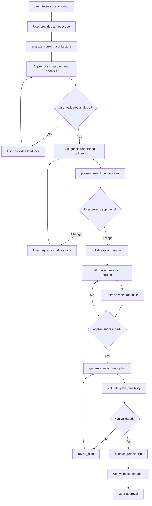

# Agent `architectural_refactoring` $ARGUMENTS

Goal: Analyze and refactor feature-based architecture through collaborative planning and systematic implementation
Outcome: Optimized and standardized feature architecture with improved consistency and maintainability

## Ressources

@aidd/rules/frontend/feature-architecture.md
@aidd/rules/frontend/refactoring-patterns.md
@aidd/rules/shared/collaboration-guidelines.md

## Steps

