# Odoo MCP Server - C4 Architecture Diagrams

## Level 1: System Context Diagram

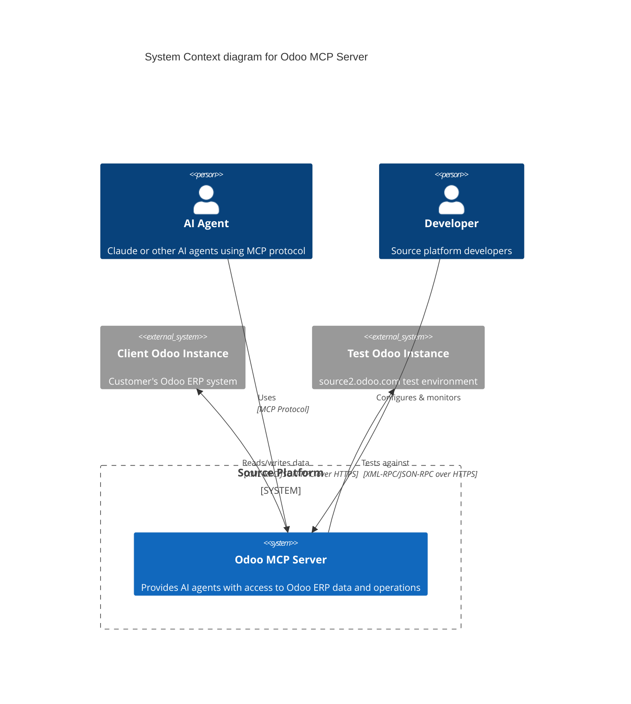

## Level 2: Container Diagram

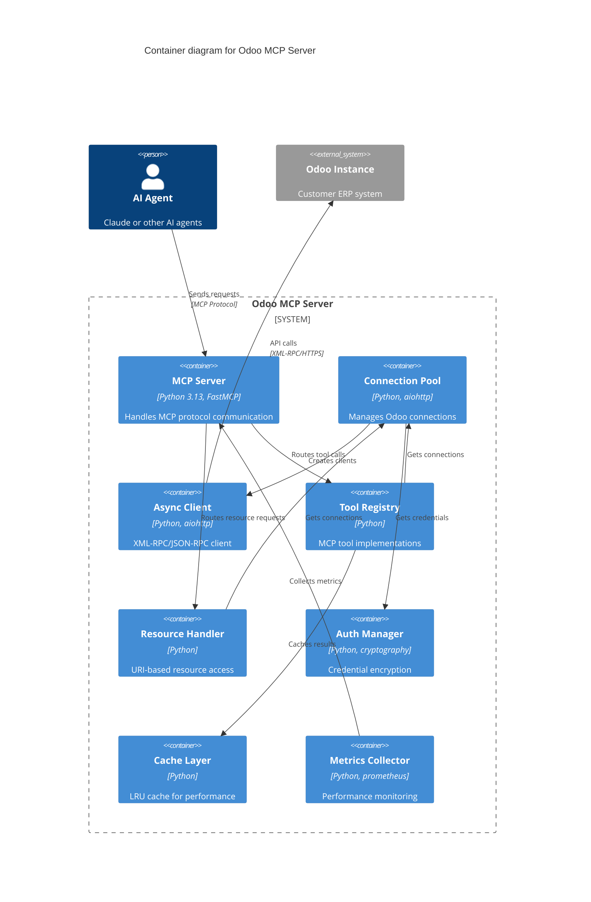

## Level 3: Component Diagram - Connection Pool

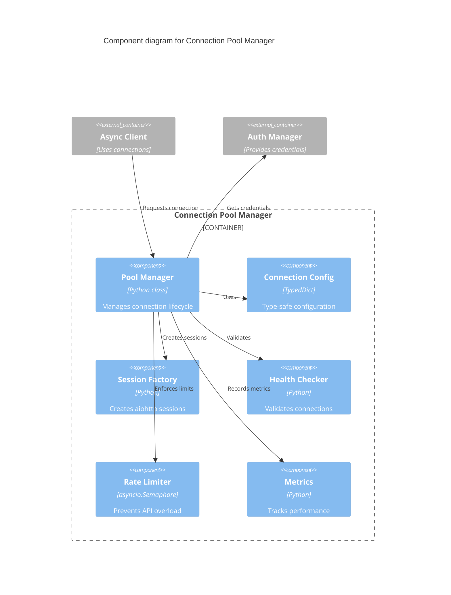

## Level 3: Component Diagram - Tool Registry

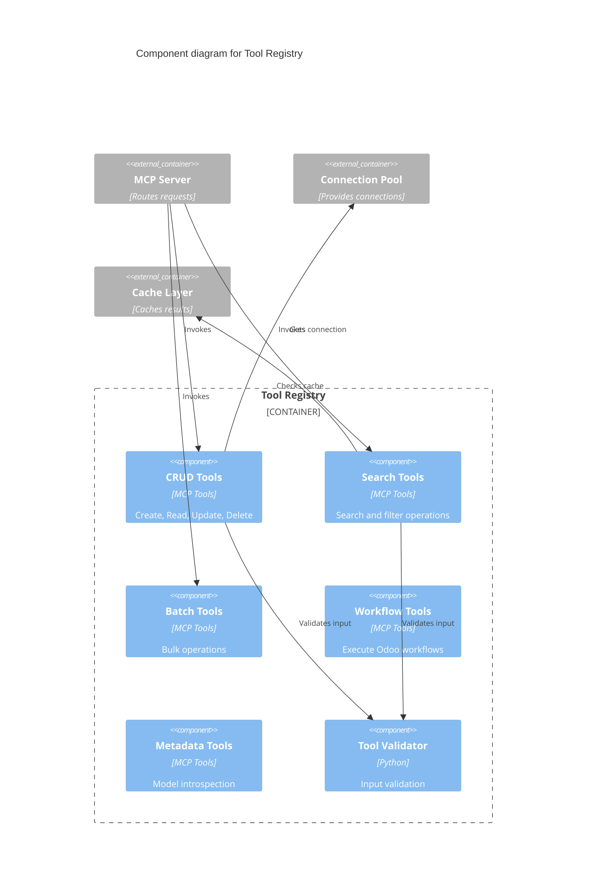

## Level 3: Component Diagram - Async Client

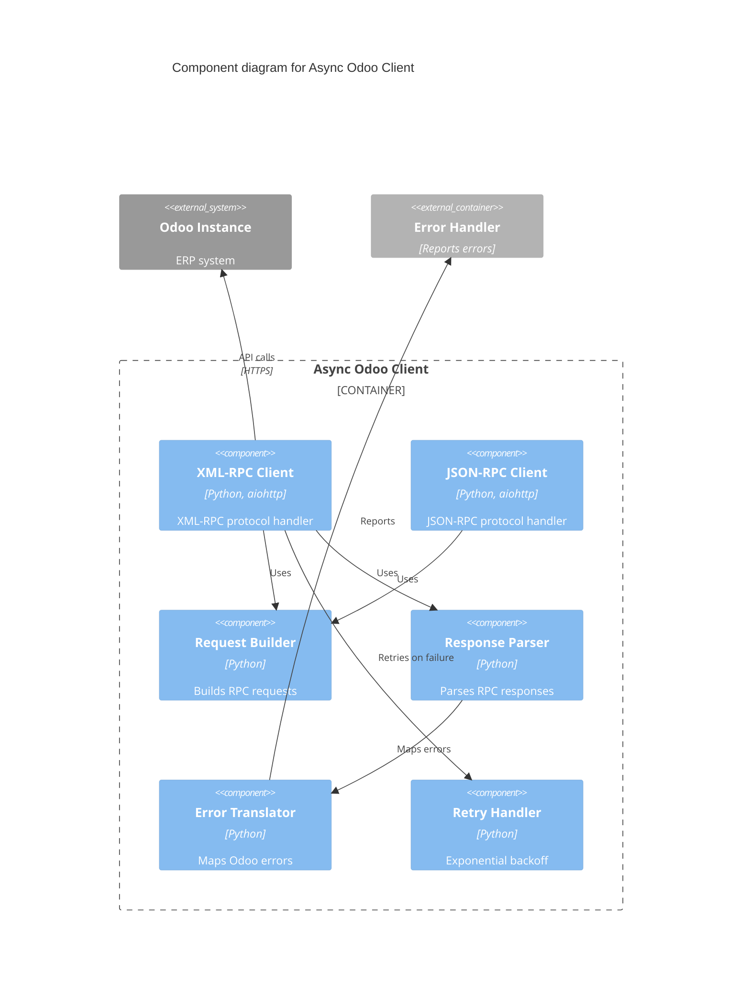

## Level 4: Code Diagram - Connection Pool Implementation

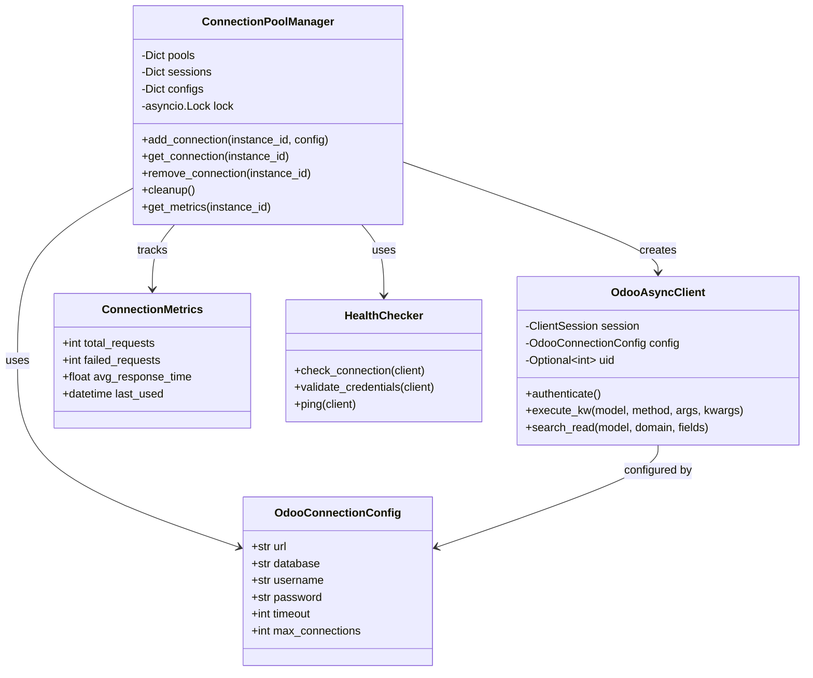

## Data Flow Sequence Diagrams

### Authentication Flow

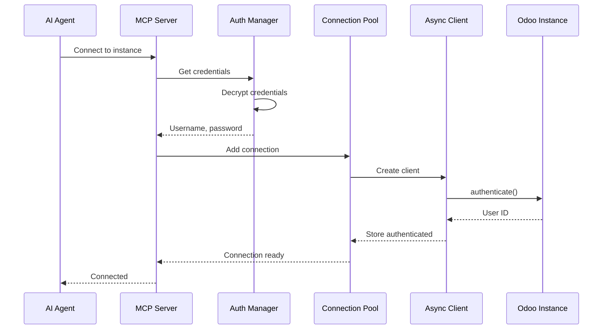

### CRUD Operation Flow

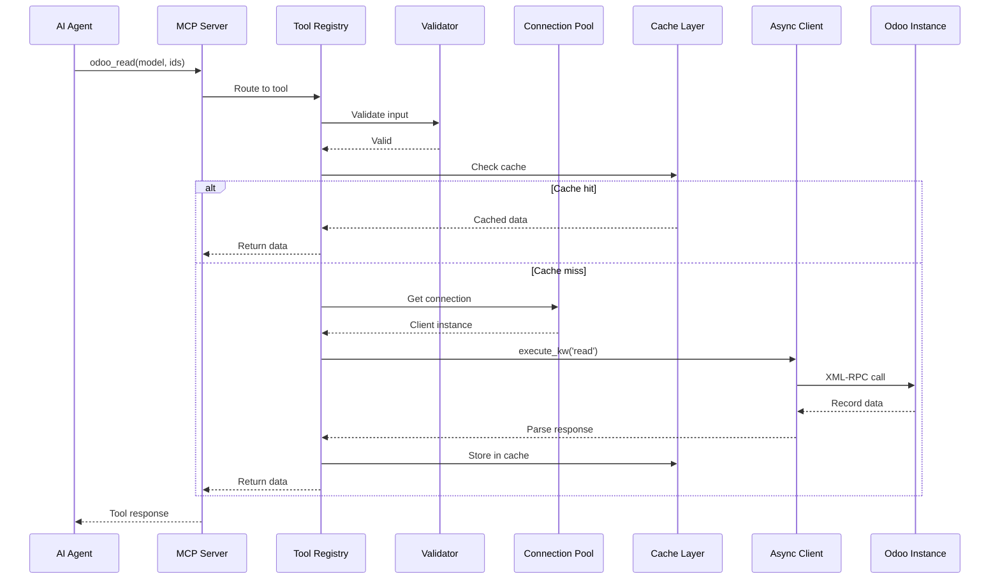

### Error Handling Flow

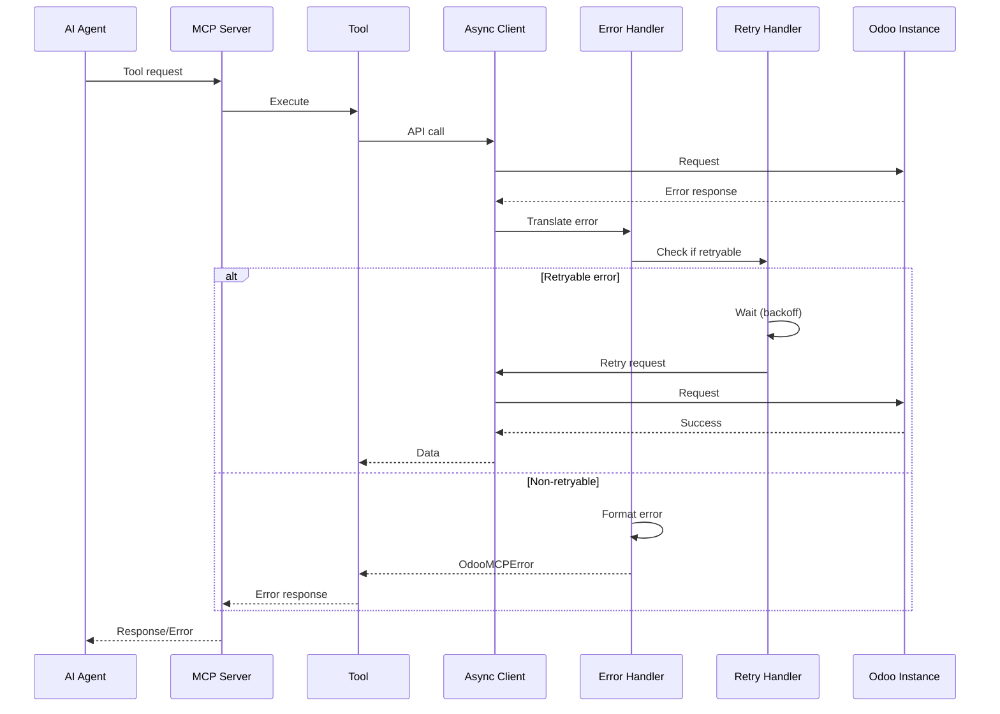

## Deployment Architecture

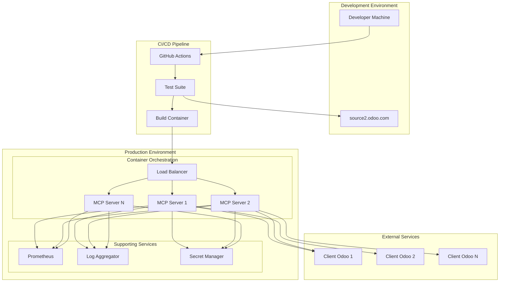

## Security Architecture

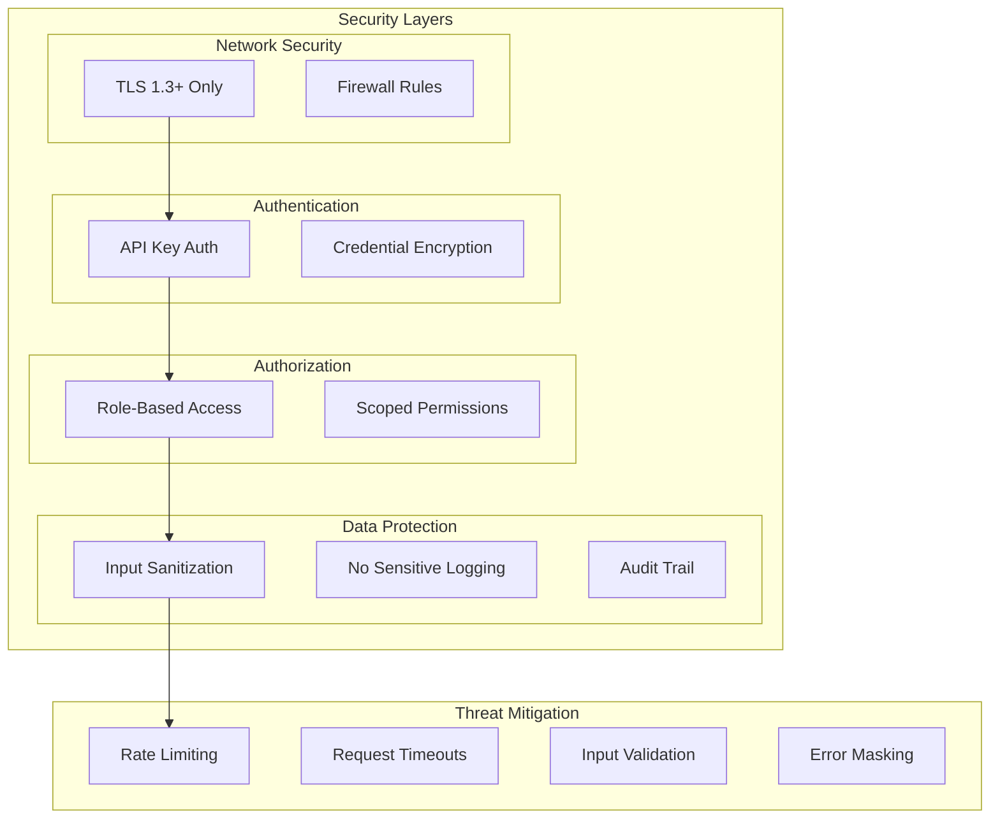