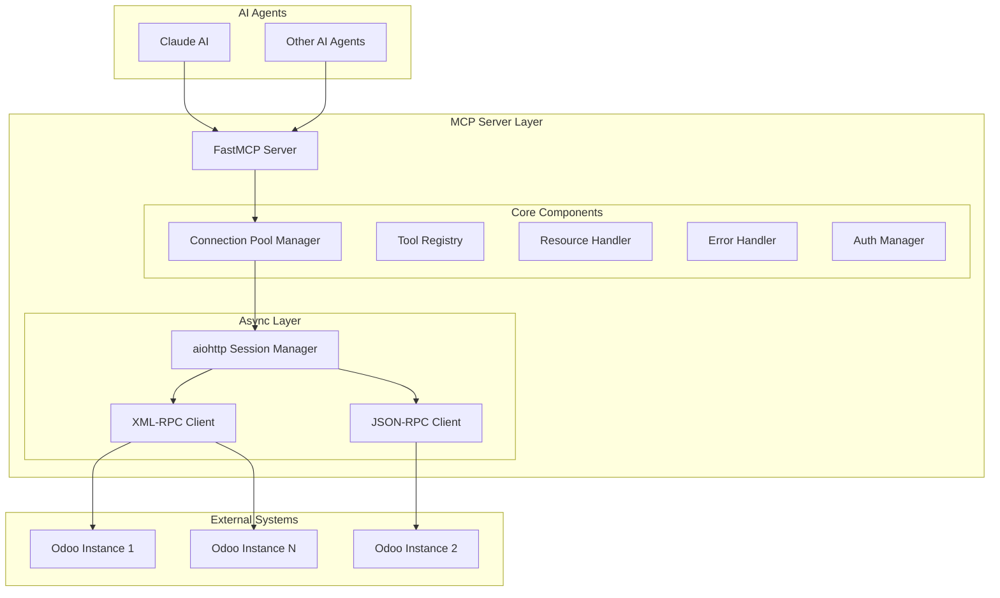
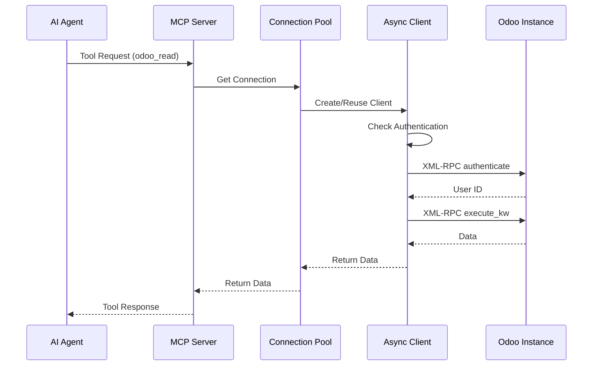

# Odoo MCP Server - System Architecture

## Executive Summary

This document defines the system architecture for the Odoo MCP Server, providing a secure, scalable, and type-safe interface between AI agents and Odoo ERP instances using the Model Context Protocol (MCP) with FastMCP framework.

## High-Level Architecture



## Component Architecture

### 1. FastMCP Server Core

```python
# src/odoo_mcp/server.py
from fastmcp import FastMCP
from contextlib import asynccontextmanager
from typing import Dict, Any

@asynccontextmanager
async def lifespan(mcp: FastMCP) -> Dict[str, Any]:
    """Manage server lifecycle with connection pooling."""
    # Initialize components
    connection_pool = ConnectionPoolManager()
    await connection_pool.initialize()
    
    # Initialize registries
    tool_registry = ToolRegistry()
    resource_handler = ResourceHandler()
    
    yield {
        "connection_pool": connection_pool,
        "tool_registry": tool_registry,
        "resource_handler": resource_handler
    }
    
    # Cleanup
    await connection_pool.cleanup()

mcp_server = FastMCP(
    name="odoo-mcp-server",
    version="1.0.0",
    lifespan=lifespan
)
```

### 2. Connection Pool Manager

```python
# src/odoo_mcp/core/connection_pool.py
from typing import Dict, Optional, Protocol
from dataclasses import dataclass
import asyncio
import aiohttp
from contextlib import asynccontextmanager

@dataclass
class OdooConnectionConfig:
    """Type-safe connection configuration."""
    url: str
    database: str
    username: str
    password: str
    timeout: int = 30
    max_connections: int = 10

class OdooConnection(Protocol):
    """Protocol for Odoo connections."""
    async def execute(self, model: str, method: str, *args, **kwargs) -> Any: ...
    async def authenticate(self) -> int: ...
    
class ConnectionPoolManager:
    """Manages multiple Odoo instance connections with pooling."""
    
    def __init__(self):
        self._pools: Dict[str, aiohttp.TCPConnector] = {}
        self._sessions: Dict[str, aiohttp.ClientSession] = {}
        self._configs: Dict[str, OdooConnectionConfig] = {}
        self._lock = asyncio.Lock()
        
    async def add_connection(
        self, 
        instance_id: str, 
        config: OdooConnectionConfig
    ) -> None:
        """Add a new Odoo instance connection."""
        async with self._lock:
            connector = aiohttp.TCPConnector(
                limit=config.max_connections,
                limit_per_host=config.max_connections,
                force_close=True,
                enable_cleanup_closed=True
            )
            
            session = aiohttp.ClientSession(
                connector=connector,
                timeout=aiohttp.ClientTimeout(total=config.timeout)
            )
            
            self._pools[instance_id] = connector
            self._sessions[instance_id] = session
            self._configs[instance_id] = config
            
    @asynccontextmanager
    async def get_connection(self, instance_id: str) -> OdooAsyncClient:
        """Get a connection from the pool."""
        if instance_id not in self._sessions:
            raise ValueError(f"No connection for instance: {instance_id}")
            
        client = OdooAsyncClient(
            session=self._sessions[instance_id],
            config=self._configs[instance_id]
        )
        
        yield client
```

### 3. Async Odoo Client

```python
# src/odoo_mcp/core/odoo_client.py
from typing import Any, List, Dict, Optional, Union
from aiohttp import ClientSession
import xmlrpc.client
import json
from io import BytesIO

class OdooAsyncClient:
    """Async client for Odoo XML-RPC/JSON-RPC operations."""
    
    def __init__(self, session: ClientSession, config: OdooConnectionConfig):
        self.session = session
        self.config = config
        self._uid: Optional[int] = None
        
    async def authenticate(self) -> int:
        """Authenticate with Odoo and get user ID."""
        if self._uid:
            return self._uid
            
        endpoint = f"{self.config.url}/xmlrpc/2/common"
        
        # Build XML-RPC request
        params = xmlrpc.client.dumps(
            (self.config.database, self.config.username, self.config.password, {}),
            'authenticate'
        )
        
        async with self.session.post(
            endpoint,
            data=params,
            headers={'Content-Type': 'text/xml'}
        ) as response:
            response_data = await response.read()
            result, _ = xmlrpc.client.loads(response_data)
            self._uid = result[0]
            return self._uid
            
    async def execute_kw(
        self,
        model: str,
        method: str,
        args: List[Any],
        kwargs: Optional[Dict[str, Any]] = None
    ) -> Any:
        """Execute a method on an Odoo model."""
        if not self._uid:
            await self.authenticate()
            
        endpoint = f"{self.config.url}/xmlrpc/2/object"
        kwargs = kwargs or {}
        
        # Build XML-RPC request
        params = xmlrpc.client.dumps(
            (
                self.config.database,
                self._uid,
                self.config.password,
                model,
                method,
                args,
                kwargs
            ),
            'execute_kw'
        )
        
        async with self.session.post(
            endpoint,
            data=params,
            headers={'Content-Type': 'text/xml'}
        ) as response:
            response_data = await response.read()
            result, _ = xmlrpc.client.loads(response_data)
            return result[0]
```

### 4. Tool Registry

```python
# src/odoo_mcp/core/tool_registry.py
from typing import List, Dict, Any, Optional, TypedDict
from fastmcp import FastMCP

class OdooSearchDomain(TypedDict):
    """Type-safe search domain."""
    field: str
    operator: str
    value: Any

class ToolRegistry:
    """Registry for MCP tools."""
    
    def __init__(self, mcp: FastMCP, connection_pool: ConnectionPoolManager):
        self.mcp = mcp
        self.connection_pool = connection_pool
        self._register_tools()
        
    def _register_tools(self):
        """Register all Odoo MCP tools."""
        
        @self.mcp.tool()
        async def odoo_create(
            instance_id: str,
            model: str,
            values: Dict[str, Any]
        ) -> int:
            """Create a new record in Odoo."""
            async with self.connection_pool.get_connection(instance_id) as client:
                return await client.execute_kw(
                    model,
                    'create',
                    [values]
                )
                
        @self.mcp.tool()
        async def odoo_read(
            instance_id: str,
            model: str,
            ids: List[int],
            fields: Optional[List[str]] = None
        ) -> List[Dict[str, Any]]:
            """Read records from Odoo."""
            async with self.connection_pool.get_connection(instance_id) as client:
                return await client.execute_kw(
                    model,
                    'read',
                    [ids],
                    {'fields': fields} if fields else {}
                )
                
        @self.mcp.tool()
        async def odoo_search(
            instance_id: str,
            model: str,
            domain: List[List[Any]],
            limit: Optional[int] = None,
            offset: Optional[int] = None,
            order: Optional[str] = None
        ) -> List[int]:
            """Search for records in Odoo."""
            kwargs = {}
            if limit: kwargs['limit'] = limit
            if offset: kwargs['offset'] = offset
            if order: kwargs['order'] = order
            
            async with self.connection_pool.get_connection(instance_id) as client:
                return await client.execute_kw(
                    model,
                    'search',
                    [domain],
                    kwargs
                )
```

### 5. Resource Handler

```python
# src/odoo_mcp/core/resource_handler.py
from typing import Optional, Dict, Any
from urllib.parse import urlparse, parse_qs
from fastmcp import FastMCP

class ResourceHandler:
    """Handle MCP resource URIs for Odoo records."""
    
    def __init__(self, mcp: FastMCP, connection_pool: ConnectionPoolManager):
        self.mcp = mcp
        self.connection_pool = connection_pool
        self._register_resources()
        
    def _parse_odoo_uri(self, uri: str) -> tuple[str, str, Optional[int]]:
        """Parse odoo://instance/model/id URI."""
        parsed = urlparse(uri)
        if parsed.scheme != 'odoo':
            raise ValueError(f"Invalid URI scheme: {parsed.scheme}")
            
        parts = parsed.path.strip('/').split('/')
        instance_id = parsed.netloc
        
        if len(parts) == 1:
            return instance_id, parts[0], None
        elif len(parts) == 2:
            return instance_id, parts[0], int(parts[1])
        else:
            raise ValueError(f"Invalid URI format: {uri}")
            
    def _register_resources(self):
        """Register resource handlers."""
        
        @self.mcp.resource("odoo://{instance}/{model}/{id}")
        async def get_record(uri: str) -> Dict[str, Any]:
            """Get a specific Odoo record."""
            instance_id, model, record_id = self._parse_odoo_uri(uri)
            
            if not record_id:
                raise ValueError("Record ID required")
                
            async with self.connection_pool.get_connection(instance_id) as client:
                records = await client.execute_kw(
                    model,
                    'read',
                    [[record_id]]
                )
                
                if not records:
                    raise ValueError(f"Record not found: {uri}")
                    
                return {
                    "uri": uri,
                    "mimeType": "application/json",
                    "data": records[0]
                }
```

### 6. Error Handler

```python
# src/odoo_mcp/core/error_handler.py
from typing import Optional, Type, Callable, Any
from functools import wraps
import asyncio
import logging
from enum import Enum

class ErrorCode(Enum):
    """Standardized error codes."""
    CONNECTION_ERROR = "E001"
    AUTHENTICATION_ERROR = "E002"
    PERMISSION_ERROR = "E003"
    VALIDATION_ERROR = "E004"
    NOT_FOUND = "E005"
    RATE_LIMIT = "E006"
    TIMEOUT = "E007"
    UNKNOWN = "E999"

class OdooMCPError(Exception):
    """Base exception for Odoo MCP errors."""
    
    def __init__(
        self, 
        message: str, 
        code: ErrorCode, 
        details: Optional[Dict[str, Any]] = None
    ):
        super().__init__(message)
        self.code = code
        self.details = details or {}

class ErrorHandler:
    """Centralized error handling with retry logic."""
    
    def __init__(self, max_retries: int = 3, backoff_factor: float = 2.0):
        self.max_retries = max_retries
        self.backoff_factor = backoff_factor
        self.logger = logging.getLogger(__name__)
        
    def with_retry(
        self,
        retryable_errors: tuple[Type[Exception], ...] = (
            asyncio.TimeoutError,
            ConnectionError,
        )
    ):
        """Decorator for automatic retry with exponential backoff."""
        def decorator(func: Callable) -> Callable:
            @wraps(func)
            async def wrapper(*args, **kwargs) -> Any:
                last_error = None
                
                for attempt in range(self.max_retries):
                    try:
                        return await func(*args, **kwargs)
                    except retryable_errors as e:
                        last_error = e
                        if attempt < self.max_retries - 1:
                            delay = self.backoff_factor ** attempt
                            self.logger.warning(
                                f"Retry {attempt + 1}/{self.max_retries} "
                                f"after {delay}s: {str(e)}"
                            )
                            await asyncio.sleep(delay)
                        else:
                            raise OdooMCPError(
                                f"Max retries exceeded: {str(e)}",
                                ErrorCode.CONNECTION_ERROR,
                                {"original_error": str(e)}
                            )
                            
                raise last_error
                
            return wrapper
        return decorator
```

## Data Flow Architecture



## Testing Architecture

### Test Structure

```
tests/
├── unit/
│   ├── test_connection_pool.py
│   ├── test_odoo_client.py
│   ├── test_tool_registry.py
│   └── test_error_handler.py
├── integration/
│   ├── test_odoo_operations.py
│   ├── test_mcp_tools.py
│   └── test_resource_handler.py
├── performance/
│   ├── test_concurrent_operations.py
│   └── test_connection_pooling.py
└── conftest.py
```

### Testing Strategy

```python
# tests/conftest.py
import pytest
import asyncio
from typing import AsyncGenerator
import os

@pytest.fixture
async def odoo_test_config() -> OdooConnectionConfig:
    """Test configuration for source2.odoo.com."""
    return OdooConnectionConfig(
        url=os.getenv("ODOO_TEST_URL", "https://source2.odoo.com"),
        database=os.getenv("ODOO_TEST_DB", "source2"),
        username=os.getenv("ODOO_TEST_USER"),
        password=os.getenv("ODOO_TEST_PASSWORD"),
        timeout=30,
        max_connections=5
    )

@pytest.fixture
async def connection_pool(
    odoo_test_config: OdooConnectionConfig
) -> AsyncGenerator[ConnectionPoolManager, None]:
    """Provide test connection pool."""
    pool = ConnectionPoolManager()
    await pool.initialize()
    await pool.add_connection("test", odoo_test_config)
    
    yield pool
    
    await pool.cleanup()

@pytest.mark.integration
class TestOdooOperations:
    """Test real Odoo operations."""
    
    async def test_crud_operations(self, connection_pool: ConnectionPoolManager):
        """Test complete CRUD cycle."""
        # Create
        async with connection_pool.get_connection("test") as client:
            partner_id = await client.execute_kw(
                'res.partner',
                'create',
                [{'name': 'Test Partner MCP'}]
            )
            assert isinstance(partner_id, int)
            
        # Read
        async with connection_pool.get_connection("test") as client:
            partners = await client.execute_kw(
                'res.partner',
                'read',
                [[partner_id]],
                {'fields': ['name', 'email']}
            )
            assert partners[0]['name'] == 'Test Partner MCP'
            
        # Update
        async with connection_pool.get_connection("test") as client:
            await client.execute_kw(
                'res.partner',
                'write',
                [[partner_id], {'email': 'test@mcp.com'}]
            )
            
        # Delete
        async with connection_pool.get_connection("test") as client:
            await client.execute_kw(
                'res.partner',
                'unlink',
                [[partner_id]]
            )
```

## Performance Optimization

### Connection Pooling Strategy

```python
# src/odoo_mcp/optimization/pool_manager.py
class OptimizedPoolManager(ConnectionPoolManager):
    """Enhanced connection pool with monitoring."""
    
    def __init__(self):
        super().__init__()
        self._metrics: Dict[str, ConnectionMetrics] = {}
        self._semaphores: Dict[str, asyncio.Semaphore] = {}
        
    async def add_connection(
        self, 
        instance_id: str, 
        config: OdooConnectionConfig
    ) -> None:
        """Add connection with rate limiting."""
        await super().add_connection(instance_id, config)
        
        # Add rate limiting semaphore
        self._semaphores[instance_id] = asyncio.Semaphore(
            config.max_connections
        )
        
        # Initialize metrics
        self._metrics[instance_id] = ConnectionMetrics(
            total_requests=0,
            failed_requests=0,
            avg_response_time=0.0
        )
```

### Caching Layer

```python
# src/odoo_mcp/optimization/cache.py
from typing import Optional, Any, Callable
import hashlib
import json
from datetime import datetime, timedelta

class CacheManager:
    """LRU cache for frequently accessed data."""
    
    def __init__(self, max_size: int = 1000, ttl_seconds: int = 300):
        self.max_size = max_size
        self.ttl = timedelta(seconds=ttl_seconds)
        self._cache: Dict[str, CacheEntry] = {}
        self._access_order: List[str] = []
        
    def _make_key(self, *args, **kwargs) -> str:
        """Generate cache key from arguments."""
        key_data = json.dumps({'args': args, 'kwargs': kwargs}, sort_keys=True)
        return hashlib.sha256(key_data.encode()).hexdigest()
        
    async def get_or_compute(
        self,
        func: Callable,
        *args,
        **kwargs
    ) -> Any:
        """Get from cache or compute and store."""
        key = self._make_key(*args, **kwargs)
        
        # Check cache
        if key in self._cache:
            entry = self._cache[key]
            if datetime.now() - entry.timestamp < self.ttl:
                self._update_access_order(key)
                return entry.value
                
        # Compute value
        value = await func(*args, **kwargs)
        
        # Store in cache
        self._store(key, value)
        
        return value
```

## Security Architecture

### Authentication Flow

```python
# src/odoo_mcp/security/auth_manager.py
from typing import Optional
import secrets
from cryptography.fernet import Fernet

class AuthManager:
    """Secure credential management."""
    
    def __init__(self, encryption_key: Optional[bytes] = None):
        self.key = encryption_key or Fernet.generate_key()
        self.cipher = Fernet(self.key)
        self._credentials: Dict[str, EncryptedCredentials] = {}
        
    def store_credentials(
        self,
        instance_id: str,
        username: str,
        password: str
    ) -> None:
        """Store encrypted credentials."""
        encrypted_password = self.cipher.encrypt(password.encode())
        
        self._credentials[instance_id] = EncryptedCredentials(
            username=username,
            encrypted_password=encrypted_password,
            api_key=secrets.token_urlsafe(32)
        )
        
    def get_credentials(self, instance_id: str, api_key: str) -> tuple[str, str]:
        """Retrieve and decrypt credentials."""
        if instance_id not in self._credentials:
            raise ValueError("Unknown instance")
            
        creds = self._credentials[instance_id]
        if not secrets.compare_digest(creds.api_key, api_key):
            raise ValueError("Invalid API key")
            
        password = self.cipher.decrypt(creds.encrypted_password).decode()
        return creds.username, password
```

## Deployment Architecture

### Container Structure

```dockerfile
# Dockerfile
FROM python:3.13-slim

WORKDIR /app

# Install system dependencies
RUN apt-get update && apt-get install -y \
    gcc \
    && rm -rf /var/lib/apt/lists/*

# Install uv
RUN pip install uv

# Copy project files
COPY pyproject.toml .
COPY src/ src/

# Install dependencies
RUN uv pip install -e .

# Run server
CMD ["uv", "run", "odoo-mcp-server"]
```

### Environment Configuration

```yaml
# docker-compose.yml
version: '3.8'

services:
  odoo-mcp:
    build: .
    environment:
      - MCP_SERVER_PORT=3000
      - LOG_LEVEL=INFO
      - MAX_CONNECTIONS=100
    volumes:
      - ./config:/app/config:ro
    ports:
      - "3000:3000"
    restart: unless-stopped
```

## Monitoring & Observability

### Metrics Collection

```python
# src/odoo_mcp/monitoring/metrics.py
from prometheus_client import Counter, Histogram, Gauge
import time

# Define metrics
request_count = Counter(
    'odoo_mcp_requests_total',
    'Total number of requests',
    ['instance', 'model', 'method']
)

request_duration = Histogram(
    'odoo_mcp_request_duration_seconds',
    'Request duration in seconds',
    ['instance', 'model', 'method']
)

active_connections = Gauge(
    'odoo_mcp_active_connections',
    'Number of active connections',
    ['instance']
)

class MetricsCollector:
    """Collect and expose metrics."""
    
    @staticmethod
    def record_request(instance: str, model: str, method: str):
        """Decorator to record request metrics."""
        def decorator(func):
            async def wrapper(*args, **kwargs):
                request_count.labels(instance, model, method).inc()
                
                start_time = time.time()
                try:
                    result = await func(*args, **kwargs)
                    return result
                finally:
                    duration = time.time() - start_time
                    request_duration.labels(instance, model, method).observe(duration)
                    
            return wrapper
        return decorator
```

## Architecture Decisions

### 1. Async-First Design
- **Decision**: Use full async/await with aiohttp
- **Rationale**: Non-blocking I/O for concurrent operations
- **Trade-off**: Complexity vs. performance

### 2. Connection Pooling
- **Decision**: Per-instance connection pools with semaphores
- **Rationale**: Prevent connection exhaustion, respect rate limits
- **Trade-off**: Memory usage vs. connection reuse

### 3. Type Safety
- **Decision**: TypedDict, Protocol classes, 100% type coverage
- **Rationale**: Catch errors at development time
- **Trade-off**: Development speed vs. reliability

### 4. Real Testing
- **Decision**: No mocks, test against real Odoo instance
- **Rationale**: Ensure actual compatibility
- **Trade-off**: Test speed vs. accuracy

### 5. Modular Architecture
- **Decision**: Separate concerns into distinct components
- **Rationale**: Maintainability and testability
- **Trade-off**: Initial complexity vs. long-term benefits

## Next Steps

1. Implement core components following this architecture
2. Set up test environment with source2.odoo.com
3. Create comprehensive test suite
4. Performance testing and optimization
5. Security audit and hardening
6. Documentation and deployment guides